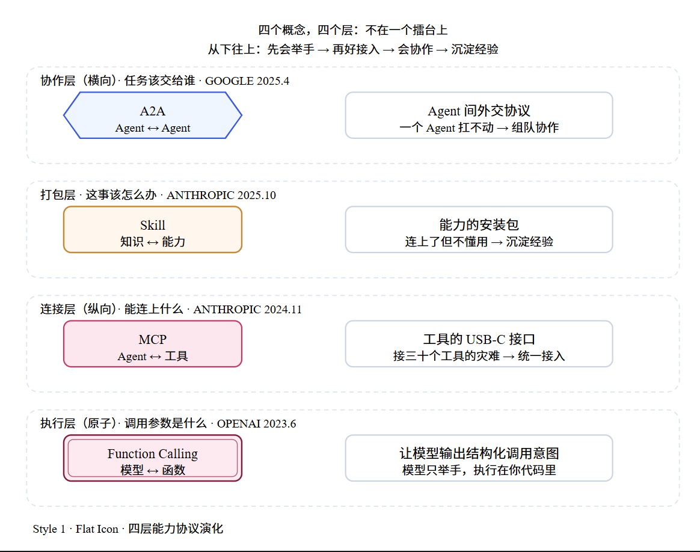
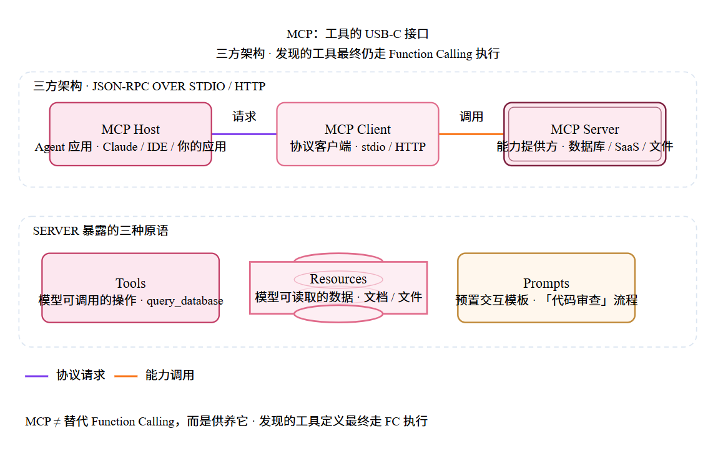
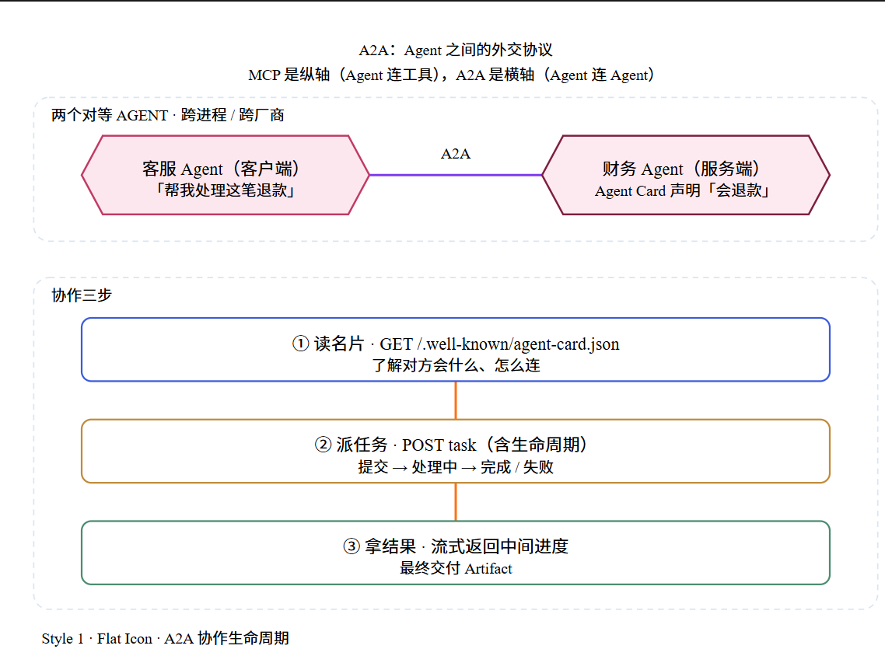
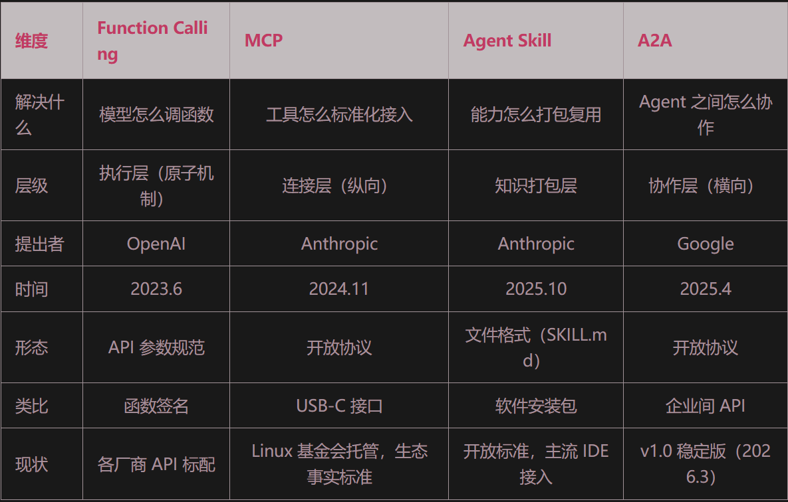
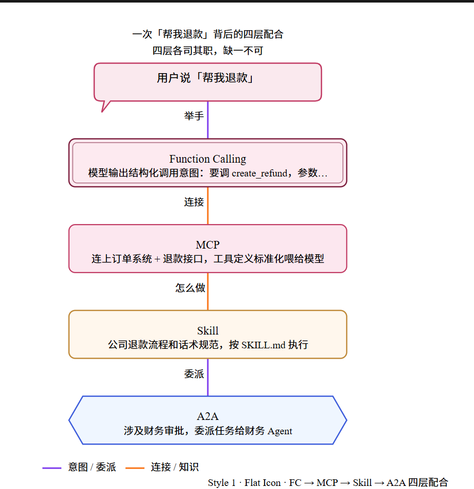
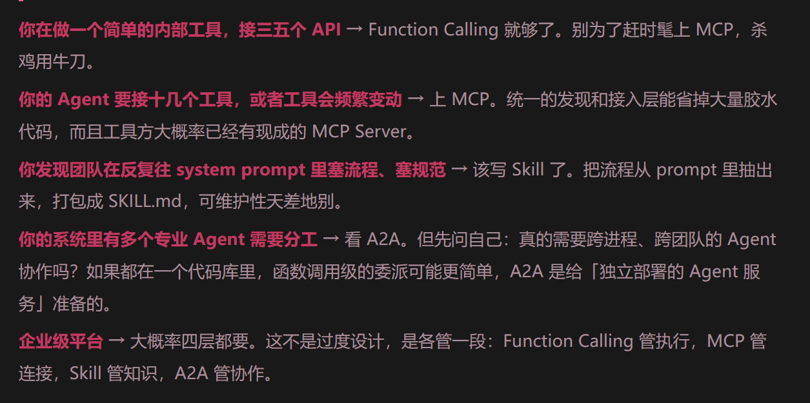

# 什么时候用mcp,什么时候用skill
我给一个团队做技术选型评审，一个工程师上来就问我：「我们到底该上 MCP 还是 Skill？听说 Skill 出来之后 MCP 就过时了。」我反问他一个问题：「你们现在最头疼的是什么？」他想了想说：「Agent 能连上我们的 CRM，但它建出来的客户跟进记录乱七八糟，完全不符合我们销售团队的规范。」

我说：「那你要的是 Skill，不是纠结 MCP。你的 Agent 已经‘能连上 CRM’了——这是 MCP 解决的、而且你已经解决了；你缺的是‘让它知道我们公司怎么用 CRM’——这是 Skill 解决的。这俩根本不是二选一，是你系统里的两层，你已经有下面那层了。」



# Function Calling
模型可以在响应中返回一个结构化json,告诉调用方,我想调这弓函数,参数是这些.这就是function calling
解决的问题: 让模型的输出从一段文字变成一个可执行的意图
之前状况: prompt写`请用json格式回答`,让模型返回json格式,但容易失败
局限: 工具定义和厂商api格式绑定死(Anthropic和Openai格式不一样),没有统一的发现机制(发现哪些工具可用),每接一个工具都要写胶水代码
误区: 只生成描述`想调什么`的json,真正执行鉴权报错处理都是后端做`,安全边界设在执行层

# Mcp
解决function calling接入很多工具需要写很多胶水代码的问题
经典模型:MCP Host(agent应用,比如claude desktop,ide)->Mcp Client(协议客户端)->MCP Server(提供能力的一方,例如数据库,saas应用)  通信用JSON-PRPC 2.0,本地stdio,远程streamable http
MCP Server三原语:
    Tools:模型可以调用的操作,例如query_database
    Resources: 模型可以读取的数据,例如文档和文件
    Prompts:预置的交互模板,例如代码审查的标准流程
MCP和function calling关系:
    mcp server发现的工具定义,最终通过function calling机制喂给模型执行,mcp解决的是工具怎么背发现,被标准化接入.function calling解决的是模型怎么调用单个工具,一个管连接,一个管执行
使用场景: 单个应用,工具清单稳定,直接function calling或rest比较快,mcp价值在多个agent复用同一批工具,工具频繁变动或想要一个不绑定模型厂商的能力目录
    判定标准: 这个能力会被不止一个host调用,则用mcp



# Skill
mcp告诉agent有什么工具可用,但不会告诉他你的组织怎么用这些工具
企业给 Agent 接了 Jira 的 MCP Server，Agent 能创建 ticket 了。但你让它为一次生产事故建个 ticket，它写出来的东西跟你们公司的模板完全不是一回事——它不知道你们要求事故单必须关联服务、标注影响面、抄送值班群。这些「怎么做」的知识，不在工具里，在 Skill 里。
skill组成:
    是一个文件夹.核心文件是SKILL.md:
```
---
name: incident-ticket
description: 按公司规范创建生产事故工单。当需要上报事故、创建 incident 时使用。
---

# 生产事故工单创建指南

## 流程
1. 调用 jira.create_issue，项目选 INCIDENT
2. 标题格式：[服务名] 现象（影响范围）
3. 必须关联 affected_service 字段
4. 严重度 P1/P2 自动抄送值班群
5. 参考模板：resources/incident-template.md
```
skill内容分三层加载:
    元数据(名称+一句话描述,约100token)
    完整指令(模型判断相关时才加载)
    资源文件(用到才读)
50个skill也就50行描述,不会爆,绕开工具太多能力就下降的问题
最精妙设计: 渐进式披露(progressive disclosure),按需加载,可跨项目复用.
模型用到哪个才完整加载哪个的完整内容,这是prompt做不到的.

# A2A agent之间的外交协议
解决多个agent之间怎么协作
核心机制:
    Agent Card(名片):每个agent在一个白哦准路径(/.well-known/agent-card.json)发布自己的名片:我是谁,我会什么(skills声明),怎么连我.客户端agent先读名片,再决定是否要跟他协作
    Task(任务):协作的基本单位,有明确生命周期(提交->处理中->完成/失败),支持流式返回中间结果
    Message&Artifact(消息与产物):任务过程中的沟通和最终产出物都有标准格式,通信走http+json-rpc,复用现有负载均衡和认证设施
```
// Agent Card 示例（简化）
{
  "name": "finance-agent",
  "description": "处理退款、对账、发票",
  "skills": [{"id": "refund", "name": "退款处理"}],
  "endpoint": "https://agent.example.com/a2a"
}
```

A2A和mcp关系:mcp是纵轴,A2A是横轴,MCP给agent装上手(连接它的工具和数据),A2A让一群agent组成团队(互相发现和委派任务).一个agent通常同时是mcp host(用mcp连自己的工具)和A2A Peer(用A2A跟别的agent协作)
使用场景:A2A是给跨进程跨团队跨厂商的独立agent服务准备的,客服agent调用另一个部门独立部署的财务agent.同一项目中的多agent(同一个代码库,同一个进程里,直接函数调用级的委派(一个agent调另一个agent的方法)更简单,不需要A2A)



# 四种概念对比

Function Calling 回答「这次调用参数是什么」，MCP 回答「这个 Agent 能连上什么」，Skill 回答「这个组织里这事该怎么办」，A2A 回答「这个任务该交给谁」。

配合:
你的客服 Agent 收到「帮我退款」→ Function Calling 让它能表达调用意图 → MCP 让它连上订单系统和退款接口 → Skill 告诉它公司的退款流程和话术规范 → 如果涉及财务审批，A2A 让它把任务委派给财务 Agent


# 使用场景


