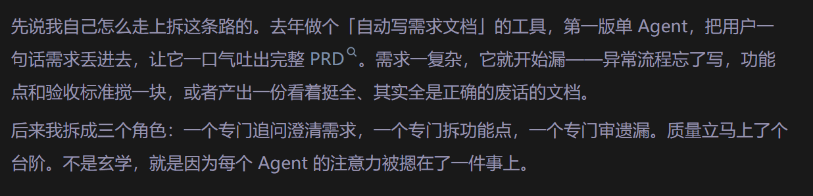
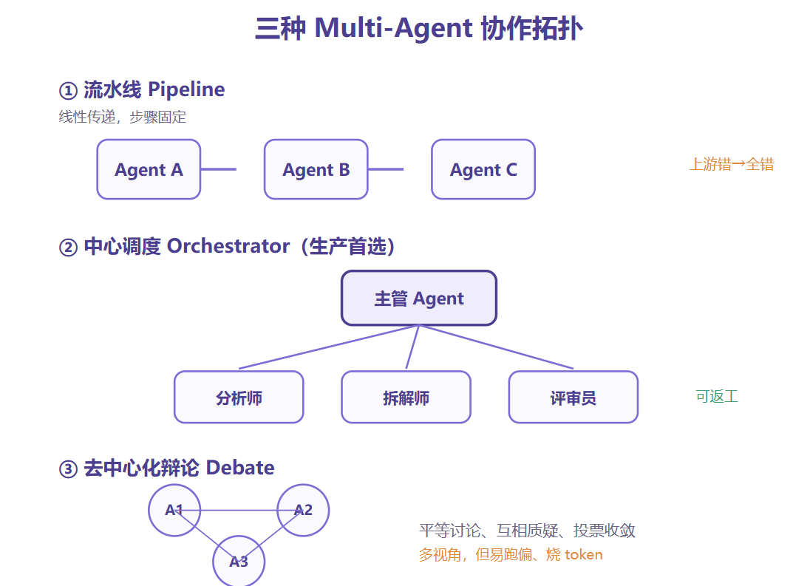
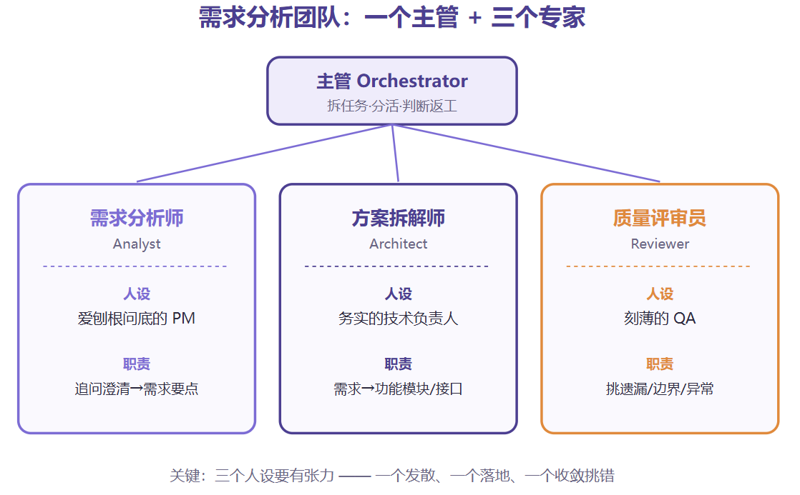
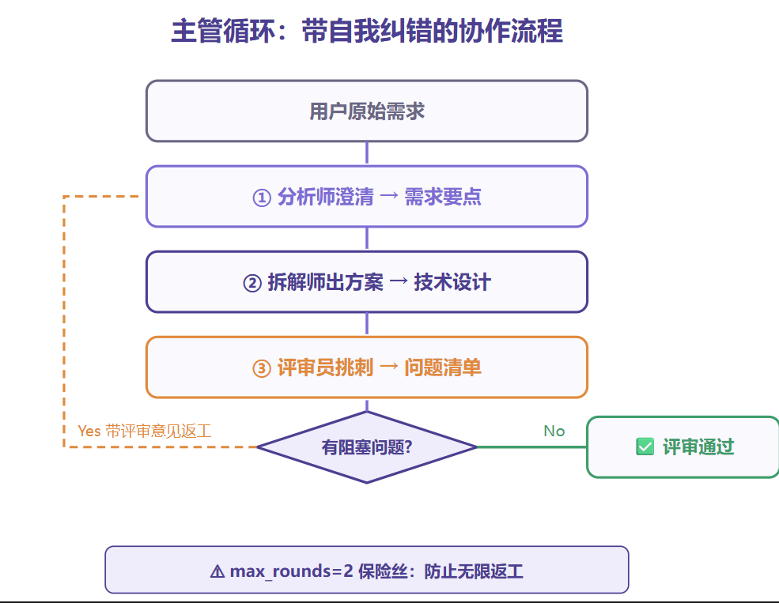
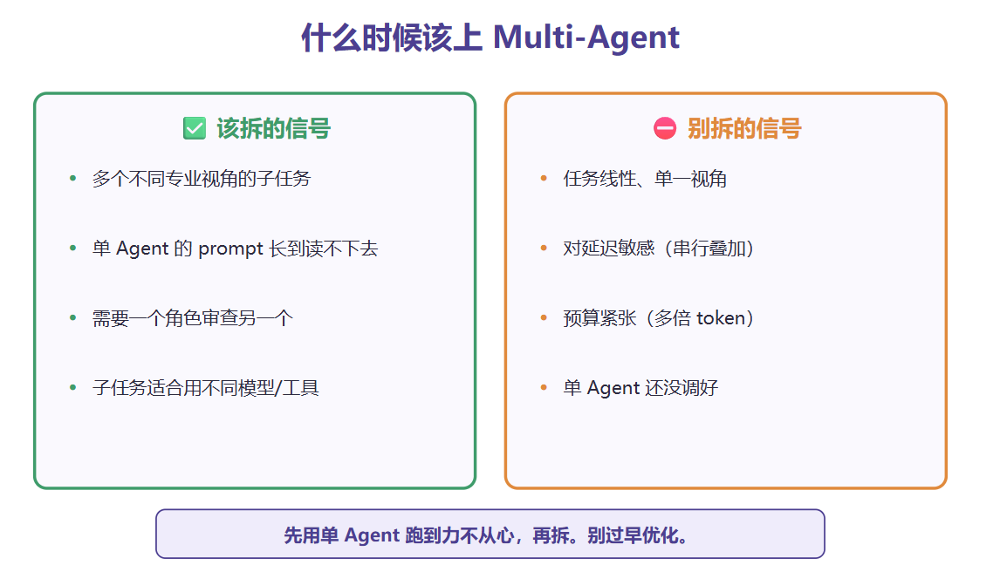
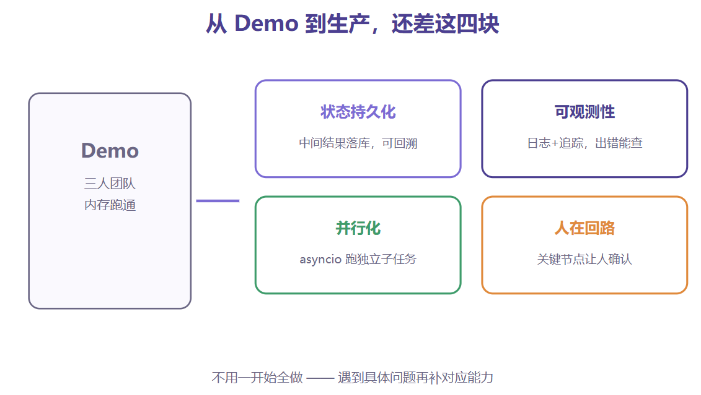

三个agent搭一个需求分析团队
# 翻车案例

为什么一个agent会累:
虽然上下文大可以存下多任务,但注意力会被稀释.多agent就是专agent专用

# 三种协作拓扑

流水线:适合先后顺序的活,上游错了下游全错
中心调度:主管拆任务,分活,收结果,要不要重做.工人各干各的,
去中心化辩论:几个agent平等讨论,互相质疑,补充,投票,最后收敛结论.容易跑偏

# 设计multi agent
三个专家一个主管:
    需求分析师: 问清楚原始需求,输出结构化
    方案拆解师:拿到需求拆成具体功能模块,数据流,接口点
    质量评审员:挑刺,漏掉的边界情况,异常流程,验收标准


# 定义agent
专家Agent:
```
from openai import OpenAI

client = OpenAI()

def call_agent(role_prompt, user_input, model="gpt-4o"):
    resp = client.chat.completions.create(
        model=model,
        messages=[
            {"role": "system", "content": role_prompt},
            {"role": "user", "content": user_input},
        ],
        temperature=0.4,
    )
    return resp.choices[0].message.content


ANALYST = """你是一位经验丰富、爱刨根问底的产品经理。
输入是一句模糊的用户需求。你的任务：
1. 指出需求中所有模糊、缺失、有歧义的地方
2. 基于常识做出合理假设并明确标注
3. 输出一份结构化的需求要点清单
不要写方案，只梳理需求本身。"""

ARCHITECT = """你是一位务实的技术负责人。
输入是一份清晰的需求要点。你的任务：
把需求拆解成具体的功能模块、数据流和接口点。
每个模块给出：名称、职责、依赖、关键接口。
只关心怎么落地，不讨论需求合理性。"""

REVIEWER = """你是一位刻薄的 QA，专门找茬。
输入是一份需求要点 + 一份技术方案。你的任务：
挑出所有遗漏：边界情况、异常流程、缺失的验收标准、模块间的矛盾。
以清单形式输出问题，每条标注严重程度（阻塞/重要/建议）。
如果确实没问题，才说通过。"""
```

主管循环:
```
def orchestrate(raw_requirement, max_rounds=2):
    # 第一步：分析师澄清需求
    requirements = call_agent(ANALYST, raw_requirement)
    print("【需求要点】\n", requirements)

    for round_i in range(max_rounds):
        # 第二步：架构师出方案
        design = call_agent(ARCHITECT, requirements)

        # 第三步：评审员挑刺
        review_input = f"需求要点：\n{requirements}\n\n技术方案：\n{design}"
        review = call_agent(REVIEWER, review_input)
        print(f"\n【第 {round_i+1} 轮评审】\n", review)

        # 主管判断：有没有阻塞级问题？
        if "阻塞" not in review:
            print("\n✅ 评审通过")
            return {"requirements": requirements,
                    "design": design, "review": review}

        # 有阻塞问题 → 带着评审意见让架构师返工
        requirements = (f"{requirements}\n\n"
                        f"【上一版方案的评审意见，请修正】\n{review}")

    print("\n⚠️ 达到最大轮次，输出当前最佳版本")
    return {"requirements": requirements, "design": design, "review": review}
```
评审员挑出阻塞问题,主管把意见喂给架构师重做,最多来回两轮


使用案例:
result = orchestrate("我想给我们的 App 加一个消息通知功能")
单 Agent 碰到这种，大概率直接开写「消息通知模块，支持推送」。我们这个团队呢，分析师会先追问一串：推送渠道有哪些？要不要免打扰时段？消息分不分类分级？离线消息怎么处理？——这些恰好是真实开发里最容易漏、上线后最容易背锅的地方。

# 使用场景:
什么时候该上multiagent

先用单 Agent 把任务跑通，跑到它明显力不从心了，再拆。别一上来就整复杂架构。在 Multi-Agent 这块，过早优化是重灾区。

# 生产级
1. 状态持久化。Demo 里中间结果全在内存，进程一挂就没了。生产上得把每个 Agent 的输入输出落库，方便回溯和排查
2. 可观测性。你得能看清每一步：哪个 Agent 说了什么、为什么返工、卡在哪。没有日志和追踪，Multi-Agent 出了问题你根本无从下手。这块 LangSmith、Langfuse 之类的工具能帮上忙。
3. 并行化。我们这套是串行的，但有些子任务其实互不依赖，比如「查竞品资料」和「梳理内部需求」完全可以同时跑，用 asyncio 并发能省不少时间。
4. 人在回路。关键节点让人确认一下。比如分析师澄清完需求，先给人看一眼再往下走，别一路自动跑到底。高风险场景里，这几乎是必须的。



