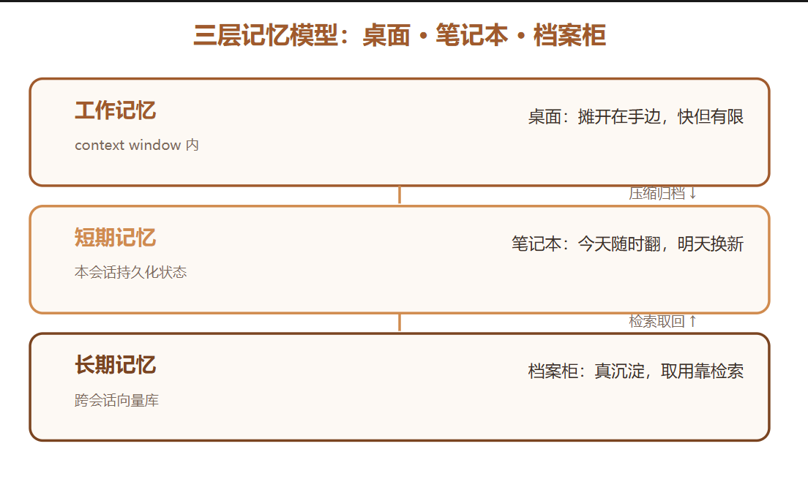
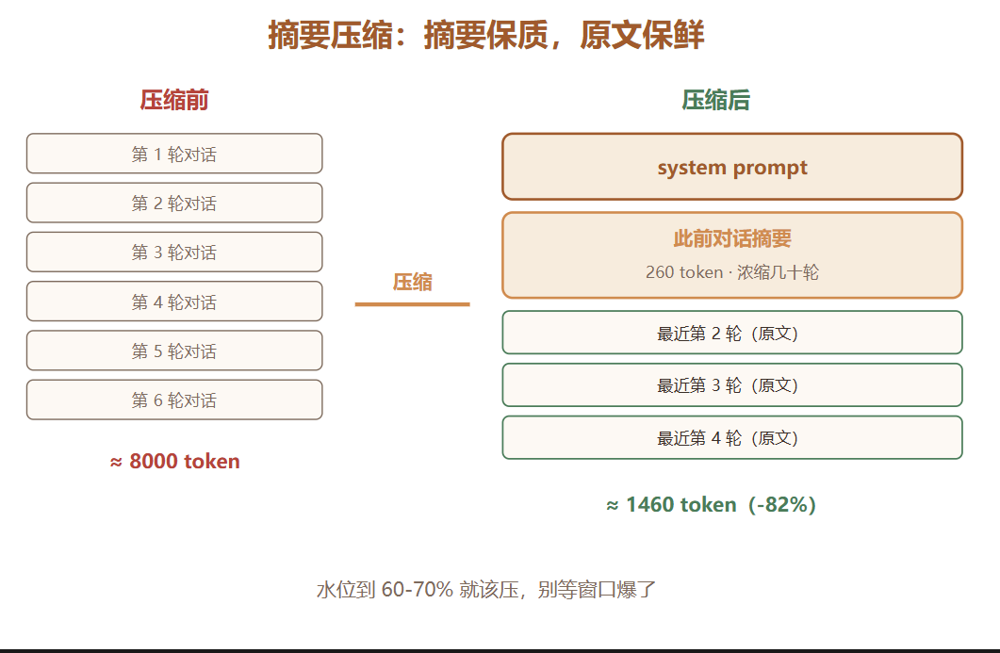
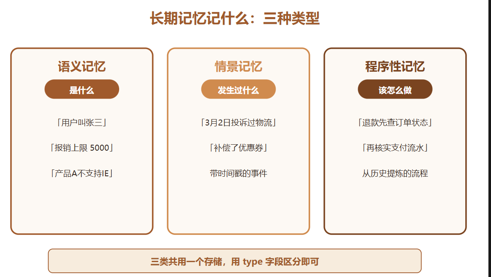
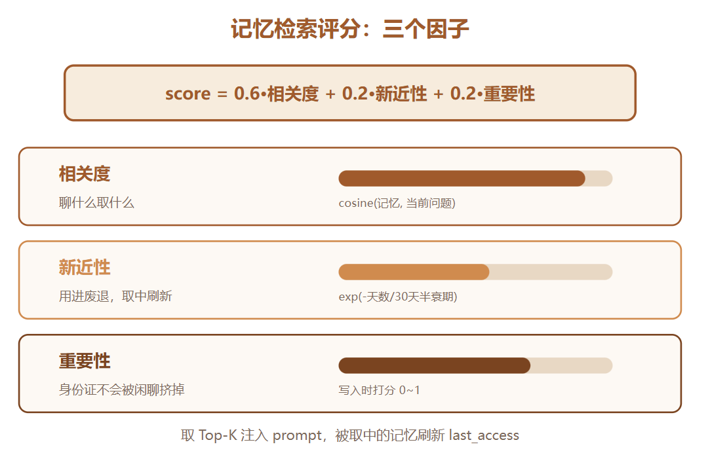
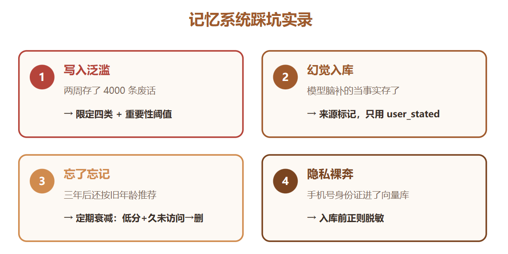
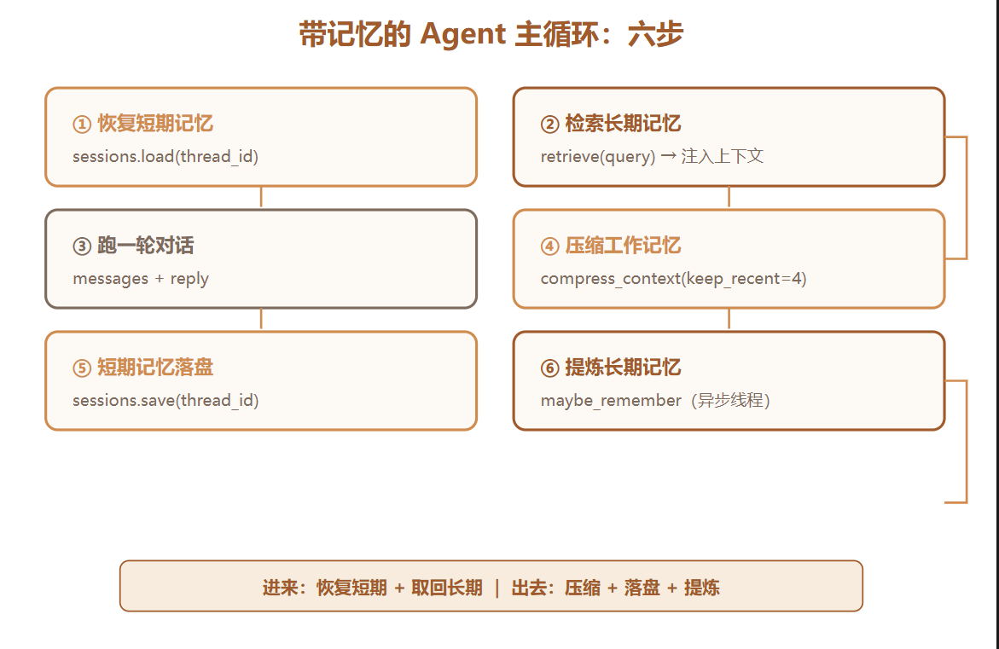
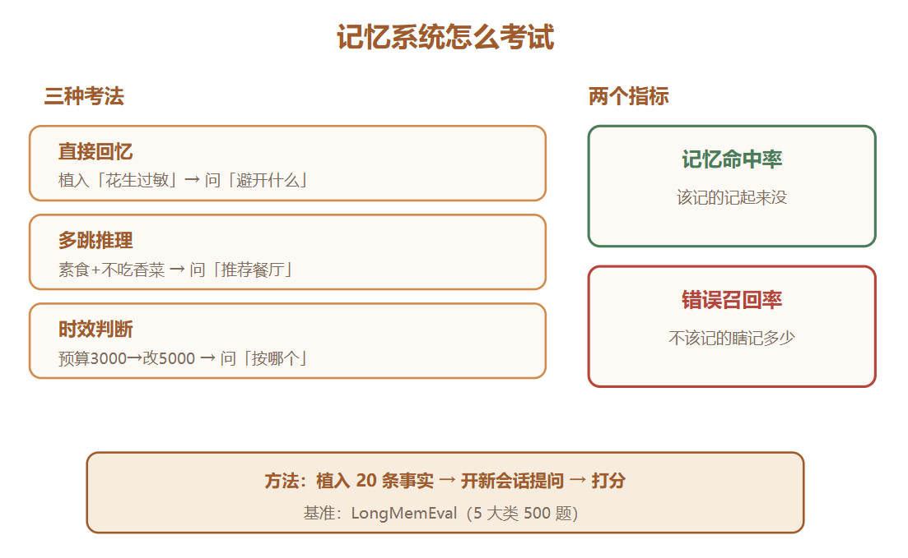

# 翻车案例
第一个是刚做客服机器人那会儿，测试同事在第三轮对话里明确说了「别用敬语，直接说事」。机器人答应得好好的。聊到第七轮，它又开始「尊敬的用户您好」。同事把截图甩群里，配了三个字：金鱼脑。
第二个更伤。有个用户上周刚纠正过产品的正确名称，这周再来咨询，机器人又把名字叫错了。用户当场就不乐意了：「我上周是不是白说了？」

# 三层记忆
1. 工作记忆Working Memory:当前context window里的东西
2. 短期记忆Session Memory:本次会话的压缩历史和状态,桌面存不下的压缩后放到本子上
3. 长期记忆Long-term Memory:跨绘画持久化的知识库


## 工作记忆:上下文窗口是稀缺资源,主流解法有两个
    1. 滑动窗口
    2. 摘要压缩:主力方案,会话变长后把早期内容让llm压缩成摘要
```python
SUMMARY_PROMPT = """把下面的对话历史压缩成摘要，保留：
1. 用户的身份、偏好、明确要求
2. 已确认的关键事实和结论
3. 未解决的待办事项
控制在 200 字以内。

对话：
{history}"""

def compress_context(messages, llm, keep_recent=4):
    # 消息数没超阈值就不压缩
    if len(messages) <= keep_recent * 2 + 1:
        return messages

    system = messages[0]
    old_turns = messages[1:-keep_recent * 2]
    recent = messages[-keep_recent * 2:]

    history_text = "\n".join(
        f"{m['role']}: {m['content']}" for m in old_turns
    )
    summary = llm(SUMMARY_PROMPT.format(history=history_text))

    return [system,
            {"role": "system", "content": f"此前对话摘要：{summary}"},
            *recent]
```
压缩后的上下文结构:
```
[system prompt]
[system: 此前对话摘要] ← 200 字，浓缩了几十轮
[user / assistant × 最近4轮] ← 原文保留，细节不丢
```


一是压缩触发时机：别等窗口快爆了才压，建议水位到 60%-70% 就动手，不然压缩这个动作本身的输入也会顶到上限。
二是摘要要滚动更新：每压缩一次，新摘要要基于旧摘要加新内容生成，而不是把旧摘要当普通历史再压一遍。套娃式压缩会让信息层层失真，压三轮下来关键事实就面目全非了。

## 短期记忆:让会话断得开,接得上
进程挂了,连接断了,用户明天回来继续聊,上下文怎么来?
把对话状态持久化,LangGZraph叫checkpointer:
```python
import sqlite3, json, time

class SessionStore:
    def __init__(self, db="sessions.db"):
        self.conn = sqlite3.connect(db)
        self.conn.execute("""CREATE TABLE IF NOT EXISTS sessions(
            thread_id TEXT PRIMARY KEY,
            updated REAL,
            state TEXT)""")

    def save(self, thread_id, messages):
        self.conn.execute(
            "REPLACE INTO sessions VALUES (?,?,?)",
            (thread_id, time.time(),
             json.dumps(messages, ensure_ascii=False)))
        self.conn.commit()

    def load(self, thread_id):
        row = self.conn.execute(
            "SELECT state FROM sessions WHERE thread_id=?",
            (thread_id,)).fetchone()
        return json.loads(row[0]) if row else []
```
关键在thread_id设计,每个用户每个对话一个独立id,状态按id隔离存取
接到agent主循环里(sqlite换成pg或redis也可):
```python
messages = store.load(thread_id) # 进来先恢复
# ... 跑一轮对话 ...
store.save(thread_id, messages) # 出去前落盘
```
服务重启、负载均衡换机器、用户换设备，全都不怕

## 长期记忆:
跨对话之前的记忆
记忆内容:
1. 语义记忆:事实和知识,回答是什么 [用户叫张三] [公司报销上限5000] 
2. 情景记忆:带时间戳的事件,回答发生过什么 [3月2号用户因为延迟投诉过一次] 
3. 程序性记忆:流程和技能,回答该怎么做,从失败或成功的历史里提炼 [处理退款要先查订单状态再核实支付流水] 


## 公用存储
三类记忆可以公用一个存储,用type字段区分

# 记忆写入: 显示加隐式
显示写入: 用户直接说:记住我对花生过敏 解析指令并存下来,但不现实
隐式提取: 每轮对话结束后,让llm判断这一轮有没有值得记的东西
```python
import time
EXTRACT_PROMPT = """从下面这轮对话中，抽取值得长期记住的信息。
只记四类：
- 用户偏好（喜欢/讨厌/习惯）
- 身份信息（姓名/角色/联系方式）
- 明确的业务事实（订单号/约定/承诺）
- 用户纠正过的错误认知
没有就输出 NONE。每条一行，格式：[类型] 内容

用户：{user}
助手：{assistant}"""

def maybe_remember(user_msg, agent_msg, store, llm):
    result = llm(EXTRACT_PROMPT.format(user=user_msg, assistant=agent_msg))
    if "NONE" in result:
        return
    for line in result.strip().split("\n"):
        line = line.strip()
        if not line:
            continue
        importance = 0.9 if line.startswith("[身份") else 0.7
        store.add(text=line, importance=importance, ts=time.time())
```

# 记忆提取: 相关性. 新近性. 重要性.
存了几百条记忆后,不能全塞进prompt,检索时给每条记忆打分,只取top-K,
评分公式借鉴认知心理学的记忆强度模型: score=α*相关性+β*新近性+γ*重要性
```python
import math, time

def recency(mem, now, half_life_days=30):
    days = (now - mem.last_access) / 86400
    return math.exp(-0.693 * days / half_life_days) # 0.693 = ln2

def retrieve(store, query, top_k=5, a=0.6, b=0.2, c=0.2):
    q_emb = embed(query)
    now = time.time()
    scored = []
    for m in store.all():
        s = (a * cosine_sim(m.embedding, q_emb)
             + b * recency(m, now)
             + c * m.importance)
        scored.append((s, m))
    scored.sort(key=lambda x: -x[0])
    for _, m in scored[:top_k]:
        m.last_access = now # 被想起的记忆，更新新近性
    return [m for _, m in scored[:top_k]]
```

相关性包装当前聊什么取什么,新近性让最近用过的记忆优先,重要性是写入时打的标,保证用户身份证这低频但关键的记忆不会因为聊的少被挤掉
权重: 默认0.6/0.2/0.2 如果用户偏好变化打,比如电商导购,β调大点,让新记忆更快盖过旧记忆

# 记忆更新: 冲突怎么办
用户变卦,三月不吃辣,6月突然开始吃辣了,旧记忆不处理容易冲突
解决: 写入时做一次冲突检测
```python
CONFLICT_PROMPT = """旧记忆：{old}
新事实：{new}
两者关系是「矛盾」还是「补充」还是「无关」？只答一个词。"""

def add_with_conflict_check(store, new_fact, llm):
    for old in store.search(new_fact, top_k=3):
        verdict = llm(CONFLICT_PROMPT.format(old=old.text, new=new_fact))
        if verdict.strip().startswith("矛盾"):
            store.delete(old.id) # 新事实覆盖旧记忆
    store.add(new_fact)
```
写之前先查,查到矛盾就删旧存新

# 踩坑
* 写入泛滥: 提取prompt限定四类,重要性低于0.5不入库,不能啥都存
* 幻觉入库: 可能是模型脑补的结果入库了,提取时只看用户说的话，或者给每条记忆打上来源标记，user_stated 还是 agent_inferred，检索时优先用 user_stated
* 忘了忘记: 记忆库只进不出,N天没访问且重要性阈值低于n归档或删除,三年后用户问「我女儿生日该准备什么」，Agent 还按三年前的年龄推荐礼物
* 隐私裸奔: 身份证等信息明文进入向量库,入库前过一层脱敏层


# 完整三层记忆案例 
```python
import threading

def agent_with_memory(user_input, thread_id, store, sessions, llm):
    # 1. 恢复短期记忆
    messages = sessions.load(thread_id) or [SYSTEM]

    # 2. 检索长期记忆，注入上下文
    memories = retrieve(store, user_input, top_k=5)
    if memories:
        mem_text = "\n".join(f"- {m.text}" for m in memories)
        messages.append({"role": "system",
                         "content": f"关于这个用户，你记得：\n{mem_text}"})

    # 3. 正常跑一轮对话
    messages.append({"role": "user", "content": user_input})
    reply = llm(messages)
    messages.append({"role": "assistant", "content": reply})

    # 4. 工作记忆压缩（防窗口爆炸）
    messages = compress_context(messages, llm, keep_recent=4)

    # 5. 短期记忆落盘
    sessions.save(thread_id, messages)

    # 6. 长期记忆提取（异步做，别挡响应）
    threading.Thread(target=maybe_remember,
                     args=(user_input, reply, store, llm)).start()
    return reply
```

进来时恢复短期、取回长期，跑完压缩工作记忆、落盘短期、提炼长期。这个骨架 30 来行，但已经是一个能投产的记忆系统雏形。
第 6 步注意我开了线程：记忆提取不挡主响应。用户等的是回复，不是你记笔记。生产上这步通常丢消息队列，慢归慢，反正用户无感。
实际效果：第一轮用户说「我对花生过敏，帮我看看这个零食能吃吗」，助手回答并存下偏好。三天后新会话，用户问「推荐点宵夜」，检索层把「对花生过敏」捞出来注入上下文，推荐自动避开花生制品。全程用户没再提过一次过敏的事。记忆的价值就在这：说一次，终身有效。

# 评估记忆系统
记忆系统上线前，我习惯给它出套卷子。做法很直接：先往库里植入 20 条事实，模拟历史对话灌进去的，然后开新会话问依赖这些事实的问题，看能不能答对
评估集要覆盖三种考法：

直接回忆
：植入「用户对花生过敏」，问「推荐零食时要避开什么」
多跳推理
：植入「用户是素食者」加「用户不吃香菜」，问「推荐一家餐厅」
时效判断
：先植入「预算 3000」，后植入「预算改成 5000」，问「按什么预算推荐」。这种考的就是冲突处理

记忆命中率（该记起来的记起来没）和错误召回率（不该记的瞎记了多少） LongMemEval 基准基于这两个进行评估


