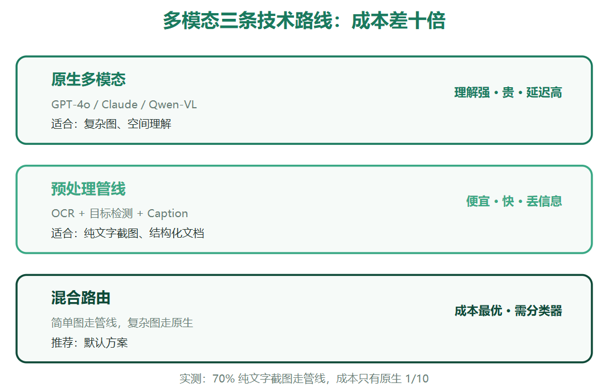
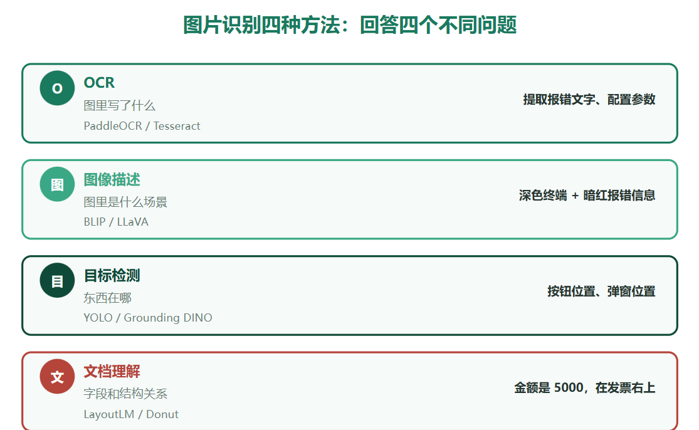
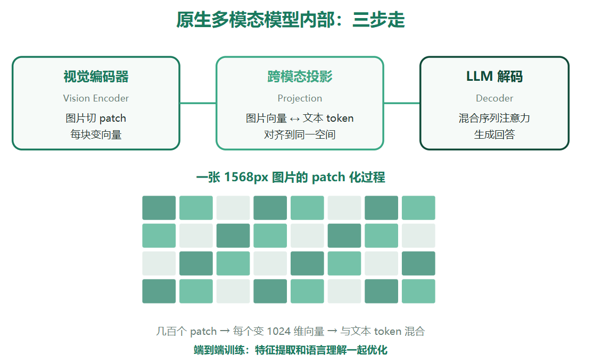

# 三条技术路线
1. 原生多模态模型
    直接把图片喂给claude等模型,很贵
2. 预处理管线
    用专用工具把图像转成文本-OCR提取文字,目标检测框出元素,图像描述模型生成caption,再把文本喂给普通llm,便宜且快.转换过程中容易丢信息
3. 混合路由
    简单的图走管线,纯文字截图用OCR,复杂的图走原生模型,哦那个轻量分类器或用规则决定走哪条路

混合路由是目前最佳的方案,纯文字报错占70%,走ocr,剩下30%是界面截图或流程图或者拍照,走原生模型

# 图片识别方式
1. OCR提取文字: PaddleOCR或Tesseract识别截图中报错信息
2. 图像描述(image captioning):回答图里是什么场景,ocr告诉你图里写什么字,caption告诉你画面讲什么
3. 目标检测(object detection):回答东西在哪儿,yolo框出目标元素
4. 文档理解(document understanding):处理pdf,发票,表格.layoutlM Donut等模型还能同时做ocr,检测表格结构,理解字段关系,[金额:5000] 能识别5000是金额的值

# 原生多模态模型的内部原理
模型怎么把图片看懂的,分为三步
1. 视觉编码器(vision encoder):把图片切成小块(patch),每块变成一个向量,做embedding. 1568px的图切成几百个patch,每个patch变成1024维的向量
2. 跨模态投影(cross-modal projection):把图片的向量序列跟文本token对齐到同一个表示空间,图片的语义和文字的语义在这弓空间可以直接比较和计算
3. 大语言模型解码:对齐后的序列喂给llm做理解和生成,跟处理文本没区别,模块看到的是图片patch向量+文字token的混合序列

# 工具
OCR: paddleOCR适合中文识别 Tesseract适合英文
目标检测: yolo
图像描述:blip_2,llava开源
whisper:语音转文字

https://mp.weixin.qq.com/s/amBkiDdunRQqGXL4JLDHfw