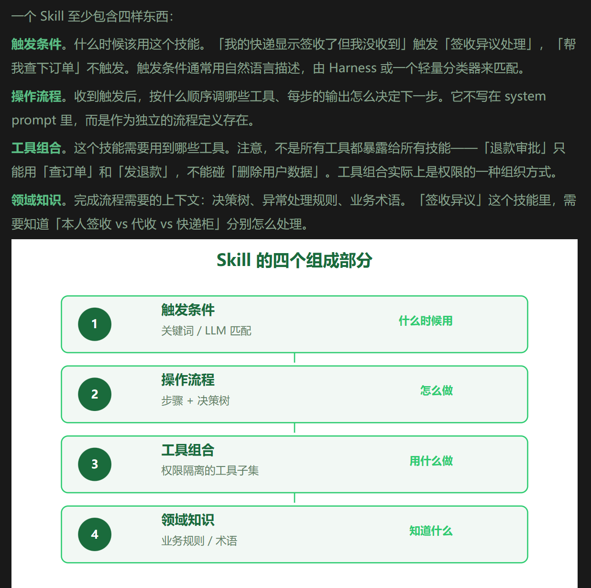
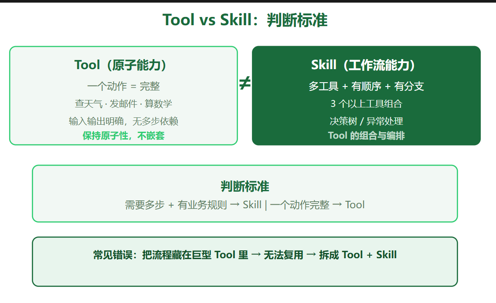
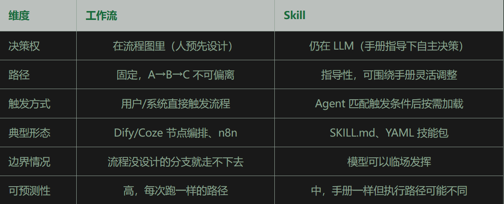
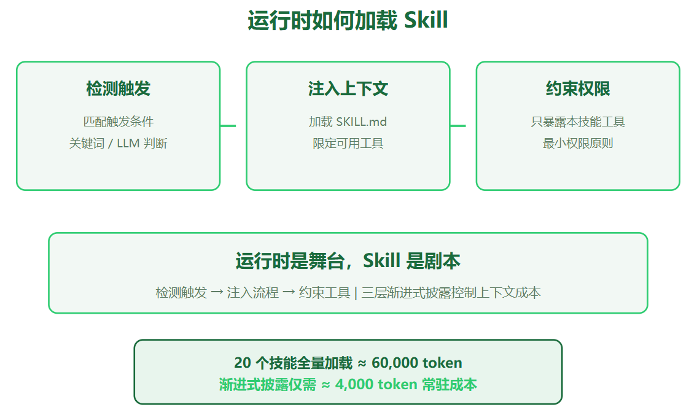

# skill用途
第七篇讲了 Tool——函数级的原子能力，把函数接上 Agent 让它能「动手」。但真实业务里 Agent 需要的不是一堆散装函数，而是一套「会干某件事」的完整能力。这中间差的那一层，就是 Skill。

去年帮一个团队做客服 Agent，接了十几个工具：查订单、查物流、退款、发优惠券、查知识库、转人工。工具本身都调通了，但客户问「我的快递显示签收了但我没收到」的时候，Agent 经常答非所问——它不知道该先查物流确认签收状态，再查订单确认是不是本人签收，再根据结果决定补发还是退款。这个「先做什么再做什么」的流程知识，工具层面根本没有。
后来我们的解法很土：把流程写死在 system prompt 里。管用是管用，但 prompt 越写越长，每来一个新场景就塞一段新流程，几个月后 system prompt 已经长到自己都不敢看了。更糟的是，流程之间开始互相干扰——处理退款的规则偶尔会污染处理物流的回答。
这个痛点就是 Tool 和 Skill 的分界线：工具是函数级的「能做什么」，技能是工作流级的「该怎么做」。

# skill组成


第一层：元数据（几十字）。Skill 的名字和一句话描述，永远驻留在 system prompt 里。模型每次只看到这一层，用来判断「这个技能跟当前任务有关吗」。

第二层：操作指令（几百到几千字）。完整的 SKILL.md 正文——触发条件、操作流程、注意事项。只有当模型判断「相关」时才加载。

第三层：资源文件（可以很大）。技能附带的参考资料、模板、脚本、示例。执行过程中用到哪个读哪个。

标准skill.md:
```txt
---
name: weekly-report
description: 生成结构化周报：汇总本周工作项、标记风险、生成下周计划。当用户要求写周报、汇总本周工作时使用。
---

# 周报生成技能

## 触发场景
用户要求写周报、汇总本周工作、生成 weekly report 时触发。

## 操作流程
1. 调用 calendar.list_events 获取本周日程
2. 调用 git.log 获取本周代码提交记录
3. 调用 jira.list_issues 获取本周任务状态
4. 按「已完成 / 进行中 / 风险项 / 下周计划」四段组织内容
5. 风险项必须给出具体的阻塞原因和建议动作，不许写「推进中」

## 输出模板
见 resources/weekly-template.md

## 注意事项
- 日期范围默认本周一到今天，用户指定则以用户为准
- 数据不足时明确标注「本周无相关记录」，不要编造
```


tool保持原子性,skill负责把原子性操作组合起来.流程不要藏在prompt里,要显性化(写在skill中)
工作流(dify,coze等都是工作流)是A-B-C流程写死的,没有让模型看着办的空间
skill是给agent的指导手册,写了大致应该这么做,具体每一步怎么做都是模型自己决定

例子:
工作流做法：用户点「申请退款」按钮 → 节点 1 查订单 → 节点 2 判断是否满足条件 → 满足走节点 3 调退款接口，不满足走节点 4 返回拒绝话术。每个节点是确定的，模型只在「生成话术」这类节点里参与，路径本身无权更改。

Skill 做法：用户随口说「我买的东西想退掉」，Agent 匹配到「退款处理」技能，加载手册。手册说「先查订单、再核政策、再决定」，但模型发现用户没给订单号时，会自主决定先问用户要——这个分支工作流里如果没画，就直接卡死了。



skill生成方式:
1. 写到skills文件夹里
```text
# skills/delivery-dispute.md
# 签收异议处理指南

当用户报告快递显示已签收但未收到时，按以下步骤处理：

1. 使用 get_logistics 查询物流详情，确认签收时间和签收方式
2. 使用 get_order 查询订单信息，确认是否为本人签收
3. 如果是本人签收但用户否认，建议用户检查是否有家人代收
4. 如果确认非本人签收，使用 transfer_to_human 转人工
5. 回复时保持同理心，不要先质疑用户
```
harness检测到触发后,放system context里喂给模型,模型自主调用工具,灵活但不稳定

2. skill市场或自生成
Skills 存在独立目录里，有市场可以下载别人写好的，也可以让 Agent 自己写——「帮我把刚才处理这个问题的流程保存成一个技能」
```text
# Agent 自己生成 Skill
def save_as_skill(conversation_history, skill_name):
    """从对话历史中提取流程，生成可复用的 Skill"""
    flow = llm.chat(messages=[
        {"role": "system", "content": "分析以下对话，提取出可复用的处理流程，用 YAML 格式输出"},
        {"role": "user", "content": conversation_history}
    ])
    with open(f"skills/{skill_name}.yaml", "w") as f:
        f.write(flow)
    return f"已保存技能：{skill_name}"
```

# 实现skill加载器
加载skill.md文件到react agent中:
metadata_prompt注入元数据给模型,决定用哪个skill
as_tools load_skill注册成agent tool,方便模型加载skill,模型看到用户请求和skill匹配时,自己调load_skill拿到完整手册并干活
load_skill加载完整skill
优化点:技能命中的缓存（同一个会话别重复加载）、工具权限隔离（每个技能只能用它声明的工具）、以及加载失败时的降级
```python
import os, re

class SkillLoader:
    def __init__(self, skills_dir):
        self.skills = {}
        for fname in os.listdir(skills_dir):
            if fname.endswith('.md'):
                path = os.path.join(skills_dir, fname)
                with open(path) as f:
                    content = f.read()
                meta = self._parse_frontmatter(content)
                self.skills[meta['name']] = {
                    'description': meta.get('description', ''),
                    'body': content,
                    'loaded': False,
                }

    def _parse_frontmatter(self, content):
        """解析 SKILL.md 头部的 YAML frontmatter"""
        m = re.match(r'^---\n(.*?)\n---', content, re.DOTALL)
        meta = {}
        if m:
            for line in m.group(1).split('\n'):
                if ':' in line:
                    k, v = line.split(':', 1)
                    meta[k.strip()] = v.strip()
        return meta

    def metadata_prompt(self):
        """第一层：只把元数据注入 system prompt（常驻，几十 token/个）"""
        lines = ["你可以使用以下技能。当用户请求匹配某个技能的描述时，"
                 "先调用 load_skill 加载该技能的完整指令，再按指令执行。"]
        for name, s in self.skills.items():
            lines.append(f"- {name}: {s['description']}")
        return "\n".join(lines)

    def load_skill(self, name):
        """第二层：模型判断相关后，加载完整指令"""
        if name not in self.skills:
            return f"技能 {name} 不存在"
        self.skills[name]['loaded'] = True
        return self.skills[name]['body']

    def as_tools(self):
        """把 load_skill 注册成 Agent 的一个工具"""
        return [{
            "name": "load_skill",
            "description": "加载指定技能的完整操作指令",
            "parameters": {
                "name": {"type": "string", "description": "技能名"}
            },
            "handler": self.load_skill,
        }]
```



# 设计事故
死法一：技能粒度失控。一个技能从「写周报」膨胀成「写周报、月报、季度总结、述职报告」，触发条件互相打架，手册长到模型看不完。解法：一个技能只干一件事，超过 5 步就拆。

死法二：把技能当 prompt 垃圾桶。凡是不知道怎么分类的指令都往技能里塞——「回复要礼貌」「不要用 markdown 表格」这种全局规则写进了某个技能里，结果只有触发那个技能时才生效。解法：全局规则留在 system prompt，技能里只放这个流程特有的知识。

死法三：技能嵌套。技能 A 的步骤里写着「执行技能 B」，两层加载下来上下文爆炸，模型直接懵掉。解法：技能保持扁平，共享的流程抽成公共子流程，由 Harness 层面组合。

死法四：触发条件重叠。「订单查询」和「物流查询」两个技能都能被「我的快递到哪了」触发，模型随机选一个，答错概率 50%。解法：要么合并，要么在描述里写清楚边界——「本技能只处理已签收后的异议，运输中的查询请用物流技能」。

死法五：上线后不维护。业务流程变了，技能手册还是三个月前的。客服按旧手册引导用户走已经下线的退款入口，投诉量暴涨。解法：技能跟代码一样进版本管理，业务流程变更时同步更新，定期跑一遍触发准确率回归。

# skill和agent runtime
Agent 的运行时——不管你是用 LangChain、自研框架还是 OpenClaw——在装配上下文时，Skills 是它注入的「能力包」。

运行时在装配上下文时做三件事：

检测。当前用户输入是否匹配某个已安装 Skill 的触发条件。可以是关键词匹配，也可以是一次轻量 LLM 调用。
注入。匹配到后，把 Skill 的流程定义或指导手册作为 system context 喂给模型，同时把该 Skill 声明的工具加入可用列表。
约束。只暴露当前 Skill 需要的工具，不是全部。这是第八篇最小权限原则在 Skill 层面的落地。
一句话：运行时是舞台，Skill 是剧本。没有舞台，剧本没法演；没有剧本，演员在台上不知道演什么。

# 做成skill的判断
该做成 Skill 的信号：
    一个任务需要调 3 个以上工具
    工具调用有明确的先后顺序，模型自己推理经常搞错
    流程里有业务规则（决策树、异常处理）
    同一个流程在多个场景复用
保持 Tool 的信号：
    动作本身就是完整的（查、写、算、发）
    输入输出明确，没有多步依赖
    不需要业务规则判断
做成了 Skill 但用错的信号：
    流程超过 5 步——拆成多个小技能
    技能里嵌了另一个技能——技能应该扁平
    触发条件跟另一个技能重叠——合并或重新划分边界

# task
让ai帮你写一个skill,实现对golang和python项目解析生成流程图,并且成功调用skill
