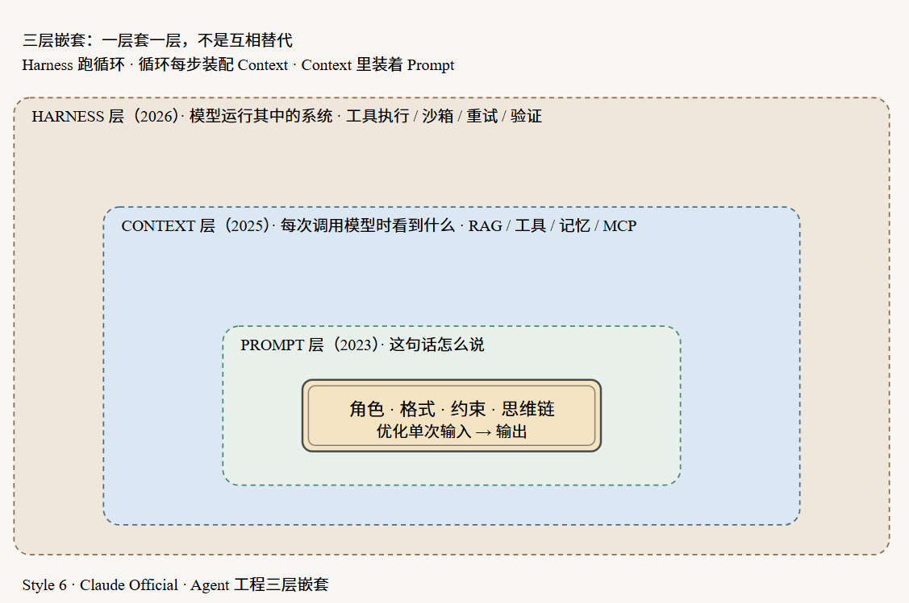
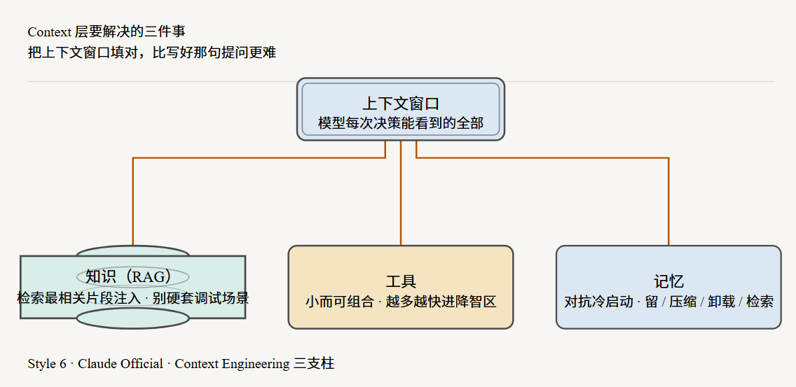
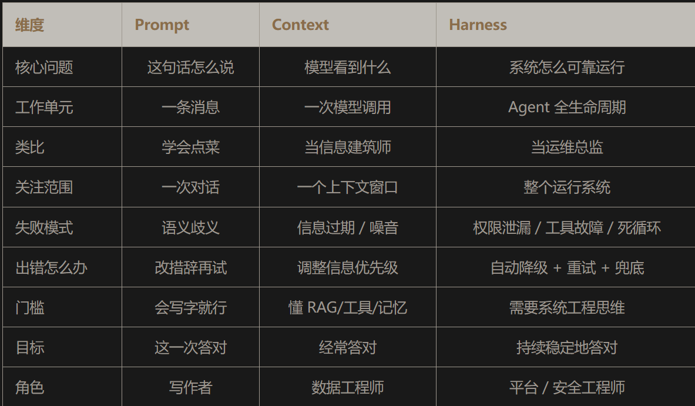
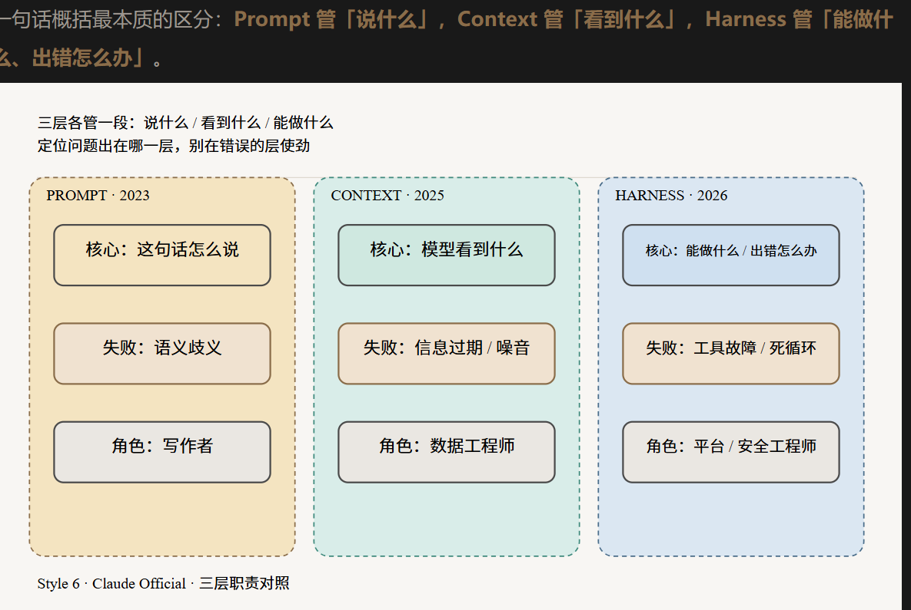

# 关系

harness context prompt是嵌套关系
Harness 跑循环，循环的每一步装配 Context，Context 里面装着 Prompt

# prompt engineering
最里面的一层,一次对话形成一个输出
```text
# 粗糙版
帮我修下这个 bug。

# 工程化版
你是一位正在排查生产 bug 的资深工程师。
背景：
- KeyError 出现在 orders.py 第 47 行
- 只在周末批处理时触发
- 系统用 PostgreSQL，带只读副本
任务：
1. 先定位根因，不要改任何代码
2. 说清是什么数据条件触发了错误
3. 提出一个保持向后兼容的修复方案
4. 列出应该补的测试
在我确认你的诊断之前，不要动任何文件。
```
限制: 注入不了私有知识库,没有权限系统,工具调用,错误恢复,如果没有工具跑测试,无法确认修复是否能编译通过
起草邮件、生成摘要、一次性格式转换、翻译分类，这些单次的、无状态的任务，Prompt 就是对的工具。可一旦任务要模型调工具、追踪状态、跨步骤协作，单靠 Prompt 就撑不住了。
所以衍生出context engineering

# context engineering
模型做决策时,应该处于什么信息环境里
定义: 当 Agent 走向更长的时间跨度和多轮推理，核心挑战变成了管理整个上下文状态，包括系统指令、工具、MCP 服务器、外部数据、消息历史。上下文窗口不只是一个 Prompt，是模型做每个决策时能注意到的全部信息。

解决问题:
1. 知识，靠 RAG 和检索: 所需知识超出上下文容量时，索引它，在需要的时刻检索最相关的片段注入进去。文档问答、策略查询这类场景很好用。但有个坑要提醒：调试任务里 RAG 效果明显变差。调试的信号不是「跟错误消息语义相似」，而是调用链、git blame、三个文件之外的符号定义，这些更接近 grep/glob 结构化搜索，而不是向量相似度。所以别把所有场景都硬套 RAG。
2. 工具，但不是越多越好: 没有工具的 LLM 读不了文件、跑不了命令、访问不了 API。但 HumanLayer 发现一个坑：接入过多 MCP 服务器，上下文窗口会被工具描述塞满，「更快地进入降智区」。他们的建议是用一小组可组合的工具（Read、Write、Grep、Glob、Bash），而不是一份不断膨胀的专用工具清单。有句话说得很精辟：「如果一个 MCP 服务器只是复制了 CLI 已有的功能，直接让 Agent 调 CLI 更好。」
3. 记忆，用来对抗无状态: 每个会话都是冷启动。这层要决定：什么留在活跃窗口、什么摘要压缩、什么卸载到持久存储、什么需要时再检索回来。短期记忆是对话缓冲区，长期记忆是结构化存储，装用户偏好、项目规则、跨会话的决策。

缺点:
但它也留了个缺口：它管模型看到什么，不管模型出错后怎么办、怎么恢复、不能越过哪条边界、怎么验证输出对不对

harness engineering用于补足该缺点
# harness engineering
每当发现 Agent 犯了一个错，就投入时间设计一个方案，让它再也不犯同样的错
定义:设计和实现一套系统，约束 Agent 能做什么、告诉它该做什么、验证它做得对不对、出错时纠正它
出现原因:进入了错误的状态，又缺乏自我纠正的机制。不澄清需求、不检查边界、无法验证结果、偏离轨道了还毫无知觉地往下跑

harness做了什么:
    完成前先跑一遍预检清单的自我验证循环
    启动时映射目录结构，让 Agent 先知道自己在哪
    循环检测中间件，识别出「反复编辑同一个文件」这种打转行为
    推理预算策略，规划阶段用高推理模型，实现阶段切换到低推理模型省钱

harness配置点:
1. CLAUDE.md / AGENTS.md，少即是多。Harness 把这些 markdown 确定性地注入系统提示。但 ETH 苏黎世测了 138 个这类文件，发现 LLM 生成的版本反而损害性能：成本涨 20% 以上，多烧 14 到 22% 的推理 token，解决率却没提升。HumanLayer 的 CLAUDE.md 不到 60 行，只放普适的简练规则，不放目录清单、不放代码库概述，那些让 Agent 自己去发现。
2. Skills，渐进式披露。与其把全部指令预加载进系统提示，不如触发特定任务时才加载对应知识。调试技能不会污染重构任务的上下文，这就是第十三篇讲的 Skill。
3. Sub-agents，上下文防火墙。研究表明模型性能随上下文变长而下降。子 Agent 从结构上解决这个问题：每个子 Agent 拿一个全新的、小的、高相关的上下文窗口，父 Agent 只接收压缩后的结果，中间的 grep 输出、文件读取全隔离在子 Agent 内部。成本还能顺势优化，父会话用高推理模型编排，子 Agent 用便宜快速的模型执行。
4. Hooks，确定性反馈循环。在 Agent 生命周期的特定事件触发，比如文件写入后、停止前。HumanLayer 验证过最有效的模式是：每次 Agent 停止后跑类型检查和 linter，只把错误信息返回给它。逻辑很简洁，成功时保持安静，只有失败才出现。错误变成反馈信号，而不是用一堆通过的输出淹没上下文。


## 对比harness prompt context



## 如何确定是harness|prompt|context问题
模型「误解了我的意思」，改改措辞就好 → Prompt 问题，你在第一层，够用就行
模型「不知道」我的代码库、我们的业务规则 → Context 问题，缺的是信息注入
任务要调用几十个工具、跨很多步 → 该往 Harness 走了
工具调用会卡住、重复写入、陷入死循环 → 明确是 Harness 问题，改 Prompt 没用
答案有时对有时错，没法稳定复现 → 缺验证和反馈机制，Harness 层的活


references:
https://mp.weixin.qq.com/s/ufbZNB3kju0q_OmlRfaD2A