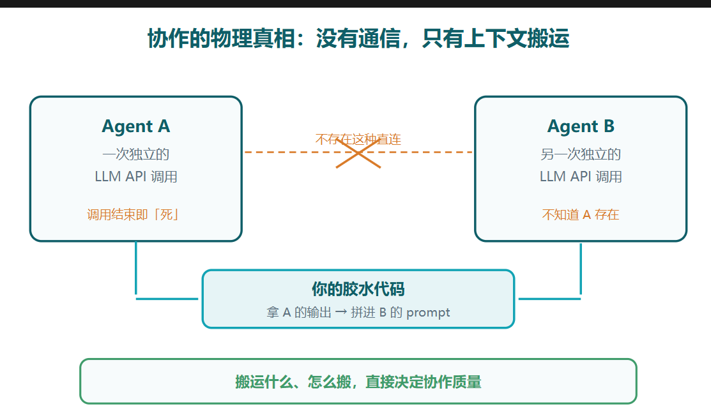
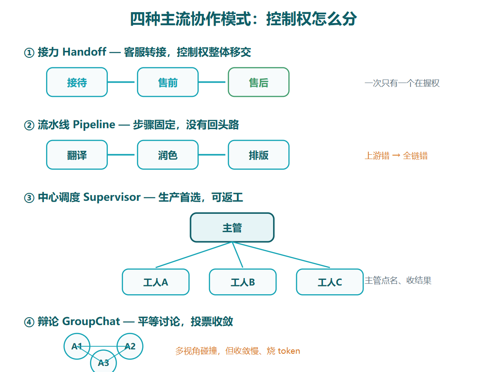
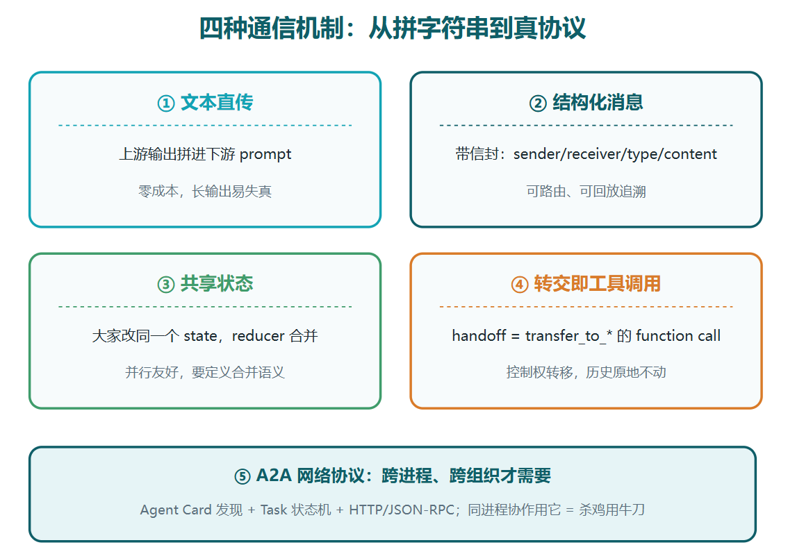
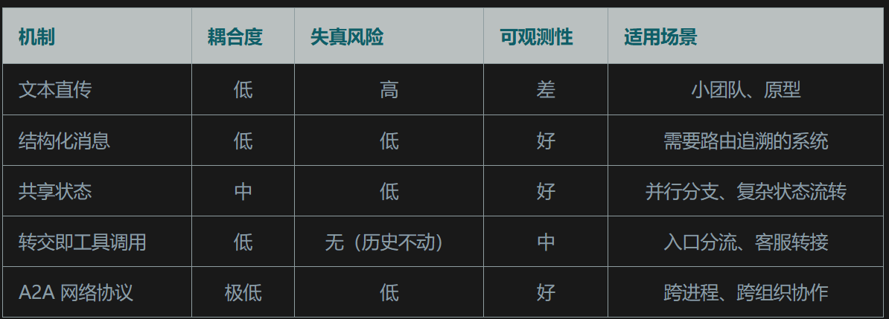
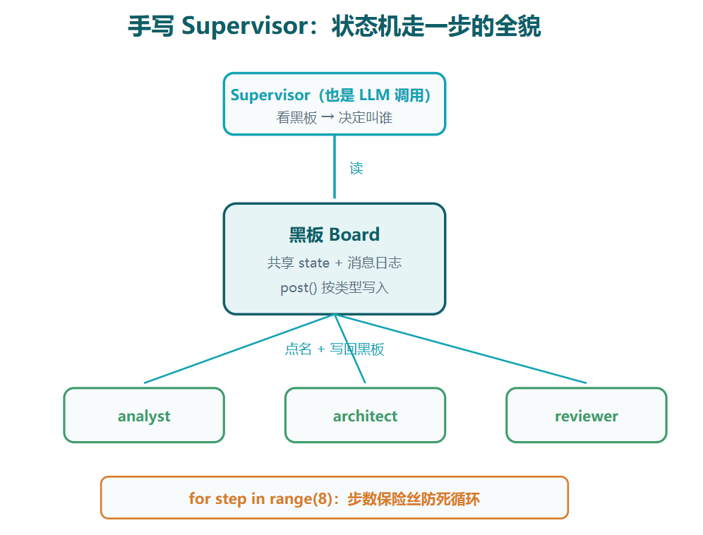
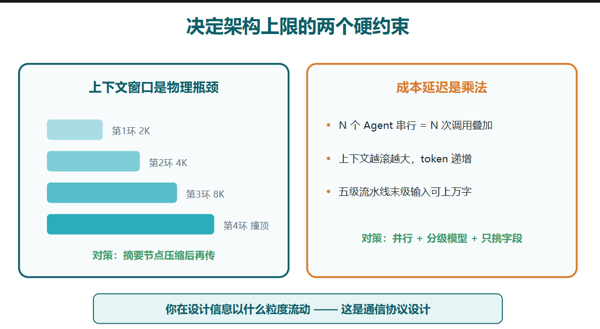
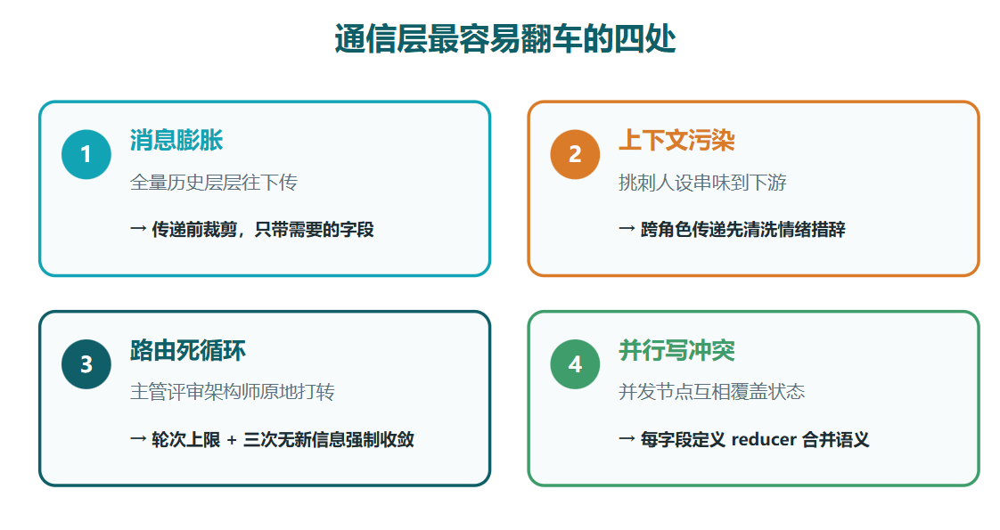
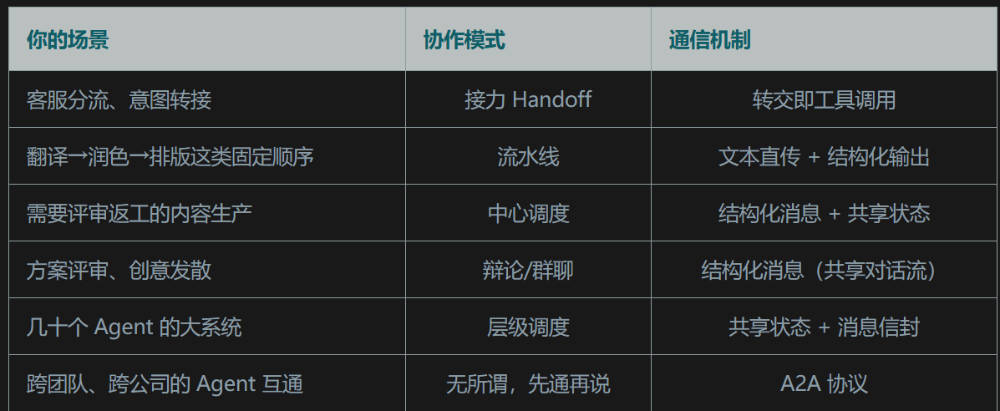

协作模式、通信机制和背后的技术原理
Multi-Agent 协作的本质不是通信，是上下文搬运；搞懂谁在搬、往哪搬、搬什么，就搞懂了整个系统
# 原理
agent之间没有通信,只有上下文搬运
我们先把「一个 Agent」拆开看。剥掉所有框架的包装，一个 Agent 就是三样东西：一段 system prompt（人设和规则）、一份对话历史（上下文）、一组可调用的工具。它的全部「思考」，发生在一次 LLM API 调用里。调用结束，它就「死」了，下次调用靠你把历史重新喂回去才「复活」
这意味着两个 Agent 之间不存在任何持久的连接。所谓协作，在物理层面只有一件事发生：
```python
# 所有 Multi-Agent 框架的底层，都是这三行
output_a = llm.call(system=A_PROMPT, context=[task]) # Agent A 干完
handoff = transform(output_a) # 你的代码搬运结果
output_b = llm.call(system=B_PROMPT, context=[handoff]) # Agent B 接手
```
中间那个 transform 就是整个系统的咽喉要道。它可以是原样透传，可以是 JSON 解析后挑字段，可以是先让另一个模型做摘要压缩。搬运什么、怎么搬，直接决定协作质量。第五篇说的「信息失真」坑，根子就在这：A 输出了三千字，B 的上下文只塞进了开头五百字，后面全丢了
所有协作模式都是这三行代码的不同组织方式:


# 四种协作模式
协作是控制权问题,谁决定下一步谁干活,干完了交给谁
1. handoff(接力):任意时刻只有一个 Agent 握着控制权，它判断「这活不归我管」，就把整个对话连同控制权一起转给下一个 Agent，自己退出。像客服转接：售前聊两句发现你要退款，直接把会话转给售后，售前下线。OpenAI 的 Swarm 和 Agents SDK 走的就是这条路。适合入口分流场景：一个前台接待，后面一排专业坐席
2. pipeline(流水线):步骤固定，A 的输出喂给 B，B 喂给 C，没有回头路。翻译、润色、排版这种天然有顺序的活用它最顺。缺点是上游错了下游全错，第五篇开头那个「市场占有率 51%」的事故就是典型的流水线翻车。
3. supervisor(中心调度):一个主管 Agent 掌握全局：拆任务、点名叫人、收结果、判断要不要返工。工人 Agent 之间互相不可见，只跟主管汇报。生产环境用得最多，因为可控、好排错、能返工。第五篇的三人团队就是这个模式。主管之上再套主管，就是层级模式（Hierarchical），本质一样，只是调度树变深了，适合几十上百个 Agent 的大系统。
4. groupchat(群聊):几个 Agent 地位平等，围着一个共享的对话流轮流发言、互相质疑，靠投票或主持人收敛结论。AutoGen 的 GroupChat 是代表。适合方案评审、创意发散这种需要多视角碰撞的开放问题。代价是收敛慢、token 烧得猛，还容易跑题


选型标准:入口分流用接力，步骤固定用流水线，需要返工和质量把关用中心调度，要多视角碰撞才上辩论


# 通信机制
把上游输出原样（或截取后）拼进下游的 prompt。第02篇的三人团队就是这么干的。优点是零成本、零依赖；缺点前面说了，长输出会失真，而且下游得从一大段散文里自己找重点。
工程改进：让上游输出结构化。让 A 用固定字段的 JSON 或编号清单输出，B 拿到的就是能直接解析的东西，失真少一大截。这也解释了为什么各框架都在推 structured output，它不是锦上添花，是 Multi-Agent 的地基

## 结构化消息: 带信封的消息对象
Envolope: 谁发的,发给谁,什么类型,正文是什么
```python
message = {
    "sender": "analyst", # 谁发的
    "receiver": "reviewer", # 发给谁
    "type": "review_request", # 消息类型
    "content": {...}, # 结构化正文
}
```
信封作用: 
    路由和追溯: 调度器可以按receiver分发,按type过滤,出问题能把整条消息链捞出来回放

## 共享状态: 大家都改一块黑板
整个系统维护一个共享的 state 字典，每个 Agent 节点干完活不「发消息」，而是返回一个「我要把 state 里的哪些字段改成什么」。
框架负责合并，然后按图的边把新 state 交给下一个节点
```python
class TeamState(TypedDict):
    requirement: str
    design: str
    review_issues: Annotated[list, operator.add] # reducer：追加而非覆盖
    round: int

def reviewer_node(state: TeamState) -> dict:
    issues = call_agent(REVIEWER, state["requirement"] + state["design"])
    return {"review_issues": issues, "round": state["round"] + 1}
    # 返回的不是消息，是对共享状态的「修改提案」
```
Annotated[list, operator.add] 叫reducer,没有 reducer，两个并行节点同时写 review_issues，后写的把先写的覆盖了，数据无声丢失。声明了 operator.add，框架就会把两边的结果合并追加
并发写共享数据，必须先定义合并语义。

## 转交即工具调用(handoff)
handoff模式,agent说这活不归我管(比如把需求设计的活给了管理员),
怎么把活给别的agent: 调用function calling的transfer_to_refund、transfer_to_tech_support,把当前对话历史原封不动给目标agent
```python
# Agents SDK 里一个 handoff 的底层面目
{
  "tool_calls": [{
    "name": "transfer_to_refund_agent",
    "arguments": "{}"
  }]
}
# 框架拦截这个调用 → 切换 system prompt → 对话历史不变 → 继续循环
```
handoff模式的通信就是控制器转移,对话历史没动地方,只是调用新的agent来运行这个会话历史上下文

# A2A协议
前面四个pipeline|handoff|supervisor|groupchat都是发生在同一个进程里,只是控制权用函数调用的方式来进行切换
但这里,agent部署在两台不同机器上,需要真正网络协议互相交互.需要A2A
A2A: 每个 Agent 发布一张 Agent Card（相当于名片，写清自己会什么、在哪），任务以 Task 为单位下发，带明确的状态机（submitted → working → completed / failed），通信走 HTTP + JSON-RPC
同进程内不需要用A2A.例如同一个pyhton程序中,函数A调函数B直接调即可,不用把函数b封装成接口,让函数A发送http请求来调,一样的道理



# 手写带通信机制的supervisor
结构化消息、共享状态、转交判断写入supervisor:
代码解析:  for step in range(8): board黑板发布任务,任务格式:消息来源"user",任务:task
    supervisor_decide主管决定根据黑板状态,下一步叫哪个agent来执行
    result = call_agent(ROLES[nxt], {"board": board.state}) 从board读取输入,调用对应agent,产出写回board
    result = call_agent(ROLES[nxt], {"board": board.state}) 执行结果写回board
```python
import json
from openai import OpenAI

client = OpenAI()

# ── 通信机制②：结构化消息信封 ──
class Message:
    def __init__(self, sender, mtype, content):
        self.sender, self.mtype, self.content = sender, mtype, content
    def __repr__(self):
        return f"[{self.sender}|{self.mtype}] {str(self.content)[:60]}"

# ── 通信机制③：共享状态黑板 ──
class Board:
    def __init__(self):
        self.state = {} # 共享状态
        self.log = [] # 消息日志，可观测性的底子
    def post(self, msg: Message):
        self.log.append(msg)
        self.state[msg.mtype] = msg.content # 按类型写入黑板

board = Board()

def call_agent(role, payload):
    resp = client.chat.completions.create(
        model="gpt-4o", temperature=0.3,
        messages=[{"role": "system", "content": role},
                  {"role": "user", "content": json.dumps(payload, ensure_ascii=False)}],
    )
    return resp.choices[0].message.content

# ── 主管：路由本身就是一个 LLM 调用 ──
SUPERVISOR = """你是调度者。看黑板状态，决定下一步叫谁。
只输出 JSON：{"next": "analyst|architect|reviewer|done", "reason": "..."}"""

def supervisor_decide():
    raw = call_agent(SUPERVISOR, {"board": board.state})
    return json.loads(raw)

def run(task):
    board.post(Message("user", "task", task))
    for step in range(8): # 保险丝：最多 8 步
        decision = supervisor_decide()
        nxt = decision["next"]
        print(f"step{step} → {nxt} ({decision['reason']})")
        if nxt == "done":
            return board.state
        # 工人从黑板读输入，产出写回黑板
        result = call_agent(ROLES[nxt], {"board": board.state})
        board.post(Message(nxt, f"{nxt}_output", result))
    return board.state
```

主管每步看一眼黑板，自己决定叫谁，这就是中心调度；消息全部带信封落日志，出问题了 board.log 一拉就能看到完整链路；黑板就是共享状态，post 按类型写入等价于一个最简 reducer；for step in range(8) 是第02篇说过的返工保险丝


生产环境需要补充的点:
    工人调用并行化（互不依赖的用 asyncio 同时跑）、黑板落库（进程挂了能恢复）、每步的 token 消耗记进日志（成本失控时能定位是哪个角色在烧钱）


# 调度器原理
调度器就是一个状态机: 节点是 LLM 调用（或工具执行），边是上下文搬运规则，状态是黑板上的数据。每次「协作」就是状态机走一步：读当前状态 → 执行节点 → 更新状态 → 按边的规则选下一个节点。LangGraph 把这件事显式化了（你画的就是状态转移图），AutoGen 把它藏在主持人循环里，但扒开看一模一样。
为什么 Multi-Agent 系统调试难？因为状态机的转移记录在你的内存里，不落盘就消失了，这就是可观测性工具（LangSmith、Langfuse）存在的理由
为什么会死循环？状态机里一条边指回前面某个节点，而终止条件没写好，跟任何状态机死循环一个道理，保险丝（max_rounds、max_steps）就是给状态机加的步数上限

上下文窗口是物理瓶颈。协作链条每多一环，搬运的上下文就长一截，撞到窗口上限后只能压缩，压缩就失真。所以长链路协作里「摘要节点」几乎必配：一个专职 Agent 把前面十轮的产物压成五百字要点，再往下传。这不是优化技巧，是通信协议设计：你在设计信息该以什么粒度流动。
成本和延迟是乘法不是加法。N 个 Agent 串行协作一次，延迟是 N 次 LLM 调用的和，token 是 N 份上下文的和，而且上下文还越滚越大。五级流水线每级传三千字，最后一级的输入可能一万五千字起步。应对办法前面都提过：能并行的并行，分级用模型，传递时只挑字段不要全文搬运。



# 踩坑
消息膨胀。每个 Agent 都把完整历史往下传，第五轮的时候上下文里躺着四轮废话，模型在长文里抓不住重点，输出质量断崖下跌。对策：传递前裁剪，只带下游需要的字段；长链路中间插摘要节点。
上下文污染。评审 Agent 的「挑刺人设」输出被原样喂回给架构师，架构师的回复开始变得防御性，花一半篇幅解释「我没错」。人设串味了。对策：跨角色传递时过一遍清洗，把情绪化的措辞滤掉，只留事实性的修改意见。
路由死循环。Supervisor 判断「还没好，叫评审再看看」，评审说「让架构师改」，架构师改完 Supervisor 又叫评审。三个 Agent 都很尽职，系统原地打转。对策：轮次上限硬编码，再加一条规则，同一个角色连续被叫三次没有新信息，强制收敛输出当前版本。
并行写冲突。两个并行节点同时更新共享状态，后写的覆盖先写的，丢数据还毫无报错。对策：用共享状态模式就必须定义 reducer，每个字段写清楚是覆盖、追加还是合并。


# 选型



