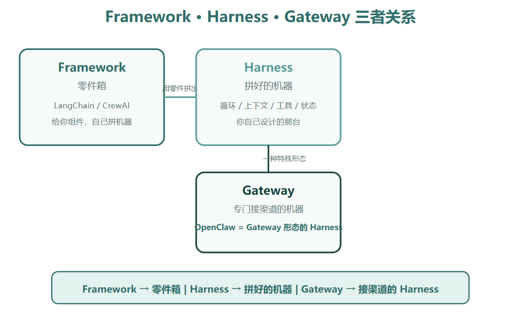
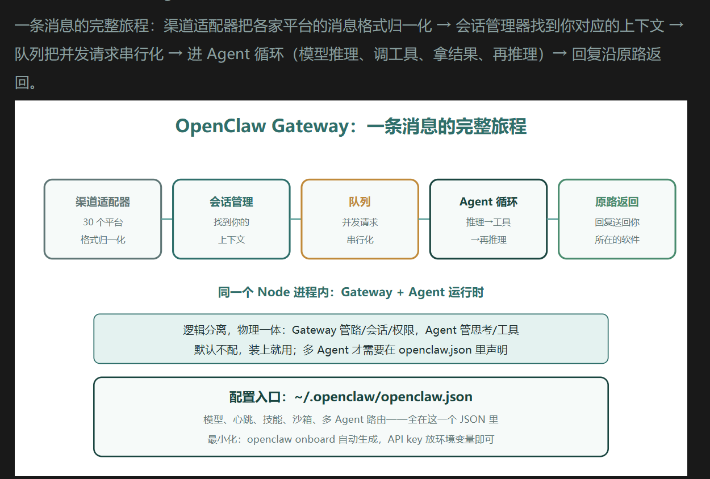
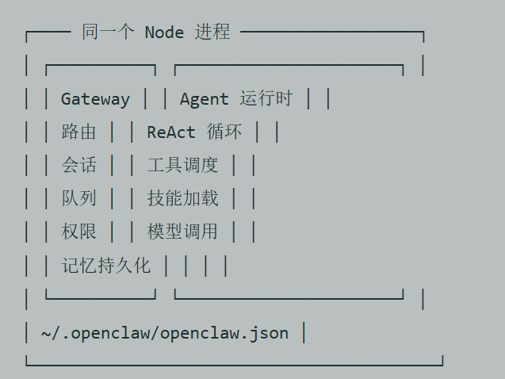
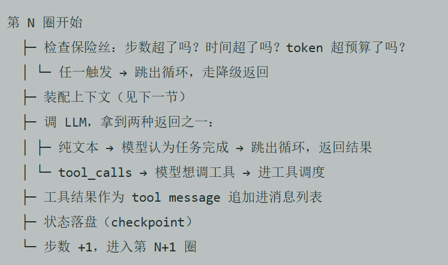
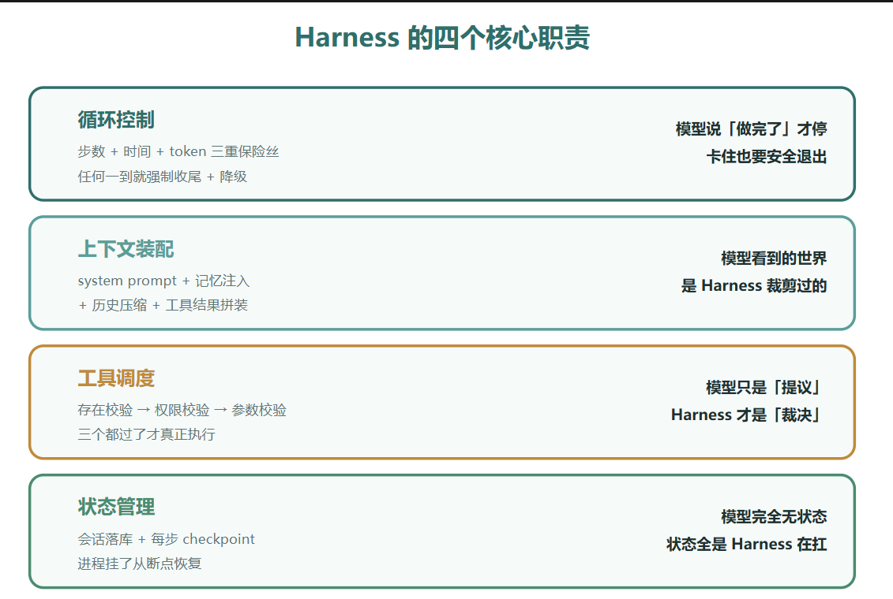
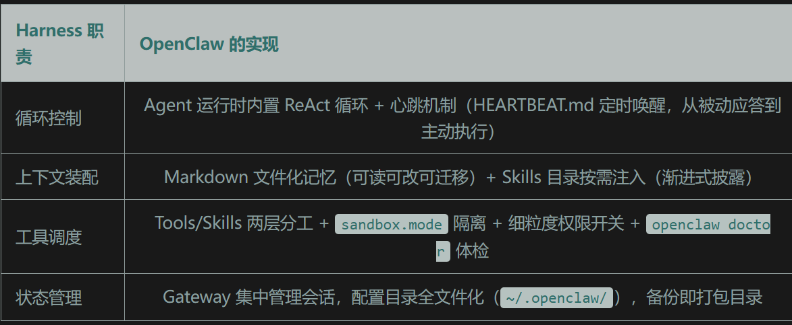
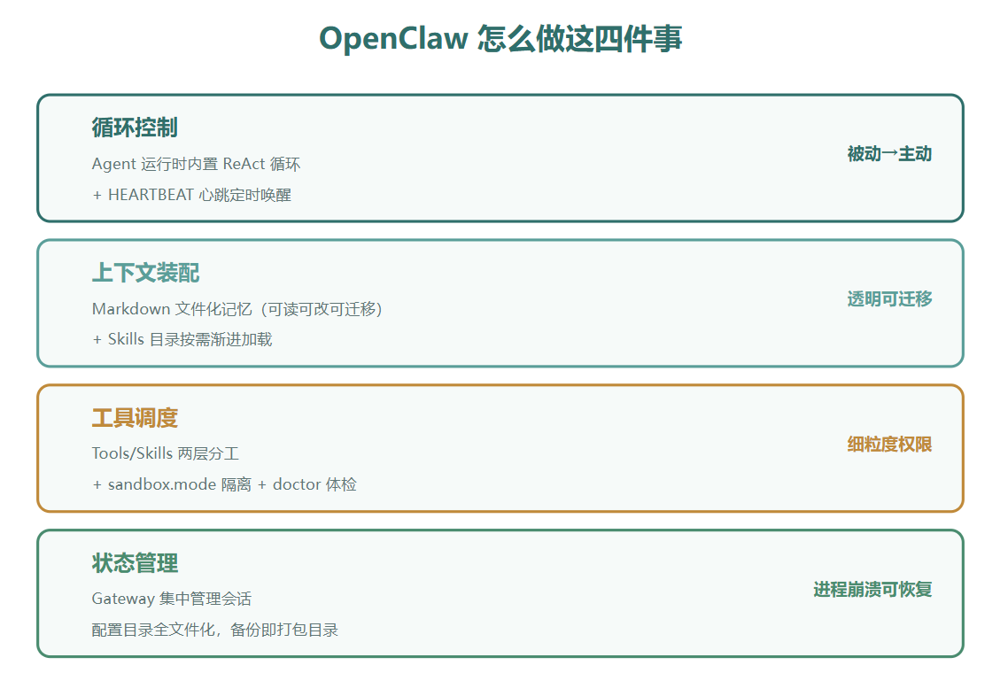
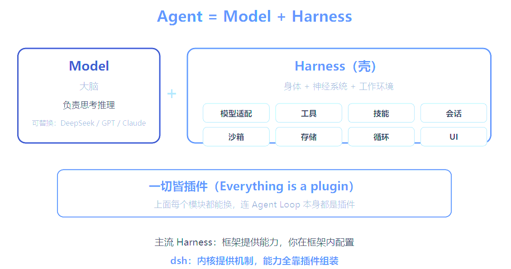
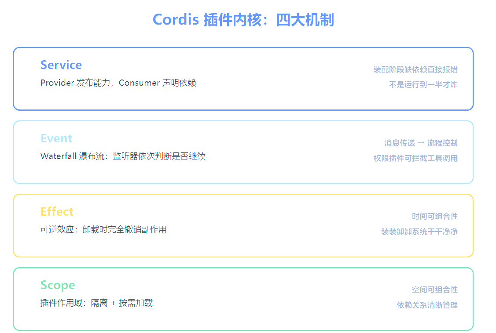

# Framework Harness Gateway概念
1. Framework框架:langchain给出chain,tool,memory组件
2. harness脚手架:llm和最终产品之间的运行时层,负责四件事:循环控制,上下文装配,工具调度,状态管理
3. gateway网关:harness的一种特殊形态,harness负责多渠道接入+会话路由+权限控制时,harness就是个gateway,例如openclaw



openclaw将30个平台(飞书微信等)的消息统一成一种格式->会话管理器找到你对应上下文->队列把并发请求串行化->进agent循环(模型推理,调tool,拿结果,再推理)->回复沿原路返回


gateway里维护路由,会话,权限,记忆持久化. agent里维护react循环,tool调度,skill加载,llm模型调用


while循环控制状态机,在循环中推理->调tool->拿结果->再推理

模型只能通过「不返回 tool_calls」这一种方式主动结束循环。除此之外的所有退出路径——超时、超步数、超预算、LLM 报错——都由 Harness 裁决。这就是「模型决定说什么，Harness 决定怎么做」在代码层的含义：循环的终止权被刻意设计成了不对称的


上下文装配:
```python
def build_context(self, session, current_input, budget=100_000):
    parts = []
    # 固定开销：system prompt + 工具定义，先扣掉
    parts.append({"role": "system", "content": self.system_prompt})
    parts.extend(self._tool_definitions())
    used = self._count_tokens(parts)

    # 记忆注入：检索相关记忆，但有单独的预算上限（比如 8K）
    memories = self.memory_store.retrieve(current_input, top_k=5)
    mem_budget = min(8_000, budget - used)
    parts.append({"role": "system",
                  "content": f"相关记忆：\n{self._truncate(memories, mem_budget)}"})
    used = self._count_tokens(parts)

    # 历史对话：拿剩下的预算，从最近的消息往前装，装不下就摘要压缩
    history_budget = budget - used - self._count_tokens(current_input)
    parts.extend(self._fit_history(session.messages, history_budget))

    parts.append({"role": "user", "content": current_input})
    return parts
```
_fit_history:保留的历史对话有三类: 最近 3-5 轮原文保留（保证对话连贯）、更早的内容让模型生成滚动摘要（保留信息但压缩体积）、工具返回的大块结果只留结论（一个 5000 字的网页抓取结果，只留模型当时提取的那 200 字结论）

状态管理:
每圈循环结束,对之前圈的会话进行checkpoint落盘,这些都是harness的sessionstate在记


## 消息进入openclaw的完整过程
T+0ms Telegram Bot API 长轮询拿到消息
T+10ms 渠道适配器把 Telegram 消息格式归一化成内部 Message 对象
          {sender: "you", text: "...", channel: "telegram"}
T+15ms 权限检查：sender 在 channels.telegram.allowFrom 白名单里吗？
          └─ 不在 → 静默丢弃或回复配对码，流程终止
T+20ms 会话管理器：按 sender 找到你的主会话，加载 SessionState
          （消息历史、之前沉淀的 Markdown 记忆文件列表）
T+25ms 队列：你手机刚发的上一条还在处理 → 这条排队等
          └─ 队列的意义：同一会话内的消息严格串行，防止上下文竞争
T+30ms Agent 循环启动，第一轮上下文装配：
          system prompt + 技能元数据 + 相关记忆（你的通勤偏好、
          常用地址）+ 压缩后的历史 + 当前输入
T+40ms LLM 第一轮推理：判断需要调 calendar.list_events 工具
T+900ms 工具调度器裁决：calendar 工具存在、有权限、参数合法 → 执行
T+1200ms 日历结果回来，追加进消息列表，checkpoint 落盘
T+1250ms LLM 第二轮推理：发现有 15:30 的会，需要再调
          traffic.estimate 算路程时间 → 再走一轮调度
T+2400ms 模型不再返回 tool_calls，生成回复文本：
          「今天一个会，15:30 在 XX。按路况 14:45 出门合适，
          我 14:30 提醒你」
T+2450ms 循环退出。同时模型写了一条记忆（你的通勤偏好有更新）
          和一条心跳待办（14:30 提醒你）到 HEARTBEAT.md
T+2500ms 回复经 Gateway 路由回 Telegram 渠道适配器，发到你的聊天窗口

gateway层(消息归一化->权限检查->会话管理->队列->agent循环->上下文装配->第一轮推理->tool->返回结果并落盘checkpoint->继续推理->不再调用tool_call->循环退出->路由到对应的工具)


## 怎么实现harness四大职责

文件化记忆：不用数据库，记忆写成一堆 Markdown 文件躺在配置目录里，你随时能翻开看它记了你什么，记错了直接改，搬家整个目录拷走。个人助手场景，透明度比检索效率重要得多。
心跳机制：每半小时醒一次读 HEARTBEAT.md，检查有没有该干的活——早报、截止提醒、后台任务收尾。这让 OpenClaw 从「被动工具」变成了「主动助手」，是「养了个员工」的关键体验。
Tools/Skills 分层：工具是函数级原子能力，技能是工作流级能力包，可以从 ClawHub 市场下载，也可以让 Agent 自己写。



# deepseek harness(dsh)
https://mp.weixin.qq.com/s?__biz=Mzg5NTQ2NzA5NQ==&mid=2247485168&idx=1&sn=5d91d56f48dc4861c899bf17e1026e07&chksm=c00eadc8f77924de2a421edd5fdf0f14cfea9c14a5c8b3f10e7599bf1eba5459424b1613e2e4&cur_album_id=4622581755303477250&scene=189#wechat_redirect
跟面试关系不大,可以不看
一般最多问下dsh有了解么,跟传统harness区别,cordis特性
模型适配、工具注册、技能系统、会话日志、Agent 循环、沙箱权限、存储调度、交互界面——听起来跟上面讲的 Harness 四职责差不多。真正的差异在组织方式：主流 Harness 里这些能力大多是写死在框架里的，dsh 把它们全部拆成了可插拔的插件。
模型可以换（不绑 DeepSeek 自家模型，任何 Provider 都能接）、工具可以换、循环机制可以换、存储后端可以换、UI 可以换（Web 或 TUI）、沙箱实现可以换、甚至 Agent Loop 本身都是一个插件。这在主流 Harness 里是看不到的——LangChain 的 Chain、OpenAI SDK 的 Runner，核心循环都是框架内置的，你能换零件，换不了发动机。


## cordis
传统harness:loop循环中写死代码,一个功能堆一组代码,很难改动
cordis解法: 四大机制
    service(服务):插件向运行时注册能力，其他插件声明依赖。Provider 发布能力，Consumer 声明依赖，装配阶段缺了关键依赖直接报错——不是运行到一半才炸。
    Event（事件）。生命周期节点上，插件可以观察、变换、拦截行为。关键是它用了 Waterfall 模式：事件广播后，监听器依次判断是否继续执行，每个监听器处理完决定是否调 next 传给下一个。这把事件从「消息传递」升级成了「流程控制」——权限插件可以拦截工具调用、压缩插件可以在上下文溢出前介入，全部通过事件链完成，Loop 自己完全不用知道。
    Effect（可逆效应）。每次上下文变换都带运行时追踪，插件卸载时能完全撤销副作用，回到安装前状态。这叫「时间可组合性」——装插件、卸插件，系统干干净净，不留下残骸。
    Scope（作用域）。插件可以隔离、按需加载，不用全挤在一个命名空间里。

未来 Agent 会在运行中动态生成、修改自身组件。如果组件卸下时不能彻底清理副作用（时间不可组合），高频修改下系统会越来越不稳定；如果依赖关系管理不好（空间不可组合），缺依赖时只能打补丁，健壮性越来越差。时空可组合性是 Agent 放心做热插拔、自我迭代的前提。
工程上来说,就是:dsh 的 Agent Loop 只负责跟大模型沟通、推进流程，其他所有事都是插件通过事件广播协作完成的
沙箱初始化是沙箱插件干的，权限校验是权限插件干的，上下文压缩是压缩插件干的。Loop 真正做到了「轻」。


