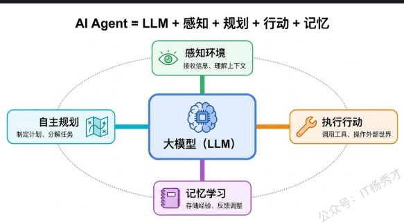
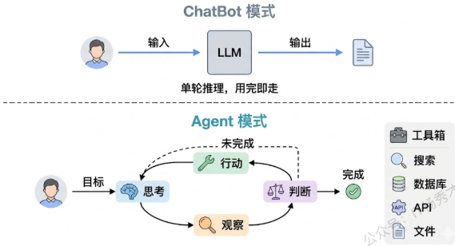
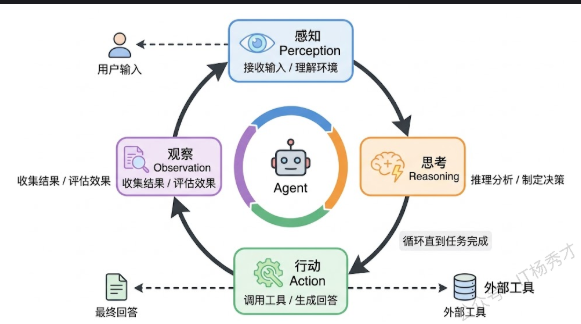
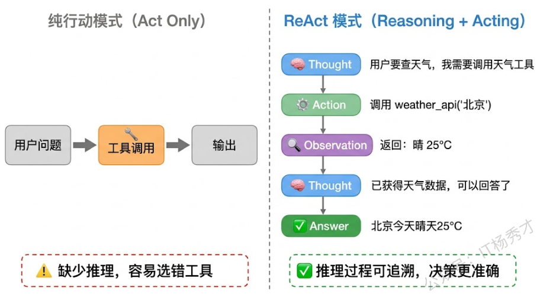
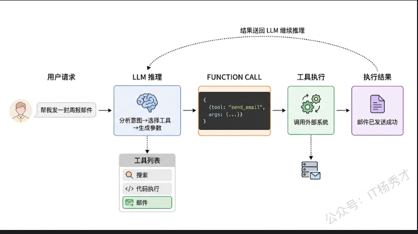
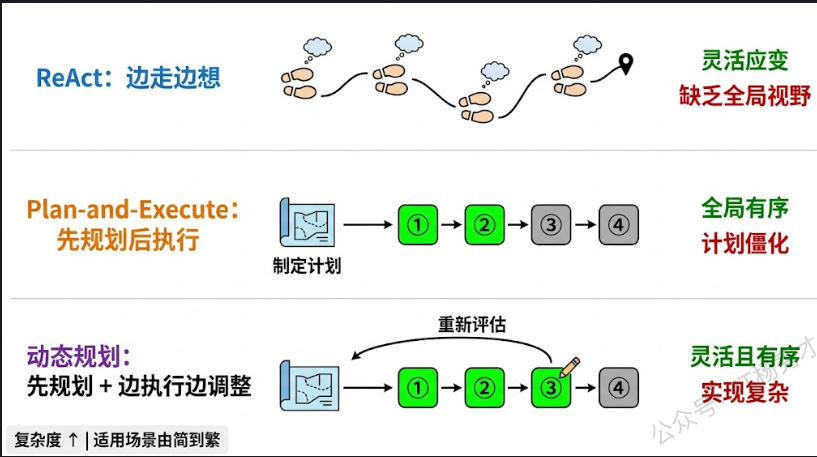
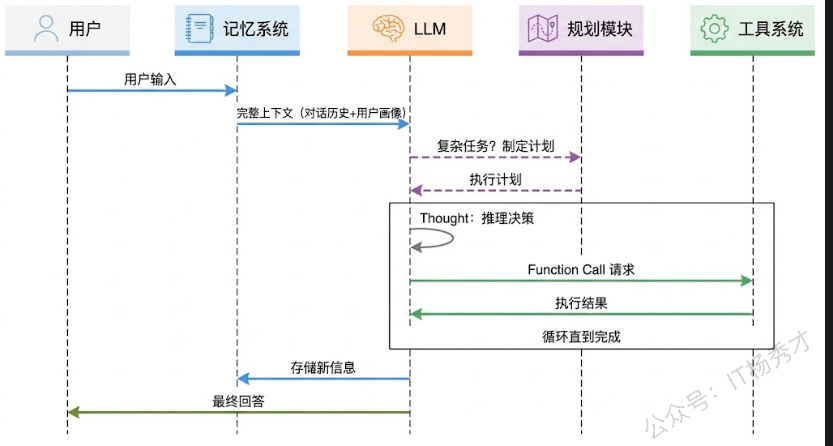

# agent定义
定义:AI Agent 是以大模型为"大脑"，能够自主感知环境、制定计划、调用工具执行任务、并从反馈中学习的智能系统


## ai和chatbox区别
1. 自主性:目标驱动,自动拆解任务,规划步骤,逐步执行,遇到问题自主调整方案
2. 工具使用能力:根据任务自主选择合适工具,例如数据库查询,搜索引擎等
3. 记忆能力:短期记忆(当前会话的上下文),长期记忆(跨会话知识积累)
4. 执行模式:处于循环中,感知-思考-行动-观察结果-思考-行动...


## agent四大能力

感知Perception
规划Planning
行动Action:tool function calling
记忆Memory:短期记忆,工作记忆,长期记忆(rag)

## agent核心架构
感知-思考-行动（Perception-Reasoning-Action）循环

```go
package main

import (
    "context"
    "encoding/json"
    "fmt"
    "os"
    "strings"

    openai "github.com/sashabaranov/go-openai"
)

// AgentLoop 实现 Agent 的核心 感知→思考→行动→观察 循环
func AgentLoop(client *openai.Client, goal string, tools []openai.Tool, maxSteps int) string {
    messages := []openai.ChatCompletionMessage{
       {
          Role: "system",
          Content: `你是一个能够使用工具的AI助手。分析用户的目标，决定是否需要调用工具。
如果需要调用工具就调用，如果已经收集到足够信息就直接回答用户。`,
       },
       {Role: "user", Content: goal},
    }

    for step := 1; step <= maxSteps; step++ {
       fmt.Printf("\n=== 循环第 %d 步 ===\n", step)

       // 【思考】大模型根据当前上下文进行推理
       fmt.Println("[思考] 正在分析当前情况...")
       resp, err := client.CreateChatCompletion(context.Background(), openai.ChatCompletionRequest{
          Model:    "qwen-plus",
          Messages: messages,
          Tools:    tools,
       })
       if err != nil {
          fmt.Printf("[错误] 请求失败: %v\n", err)
          return "抱歉，处理过程中出现了错误"
       }

       msg := resp.Choices[0].Message

       // 判断：模型是否决定调用工具？
       if len(msg.ToolCalls) == 0 {
          // 没有工具调用 → 模型认为任务已完成，直接输出回答
          fmt.Println("[完成] Agent 认为任务已完成，生成最终回答")
          return msg.Content
       }

       // 【行动】执行模型选择的工具
       messages = append(messages, msg)
       for _, tc := range msg.ToolCalls {
          fmt.Printf("[行动] 调用工具: %s, 参数: %s\n", tc.Function.Name, tc.Function.Arguments)
          result := executeTool(tc.Function.Name, tc.Function.Arguments)

          // 【观察】收集工具执行结果，送回下一轮循环
          fmt.Printf("[观察] 工具返回: %s\n", result)
          messages = append(messages, openai.ChatCompletionMessage{
             Role:       "tool",
             ToolCallID: tc.ID,
             Content:    result,
          })
       }
       // 自动进入下一轮 感知→思考 ...
    }

    return "已达到最大执行步数，任务未能完成"
}

// executeTool 根据工具名称执行对应操作
func executeTool(name, args string) string {
    switch name {
    case "search":
       var p struct {
          Query string `json:"query"`
       }
       json.Unmarshal([]byte(args), &p)
       // 模拟搜索工具
       if strings.Contains(p.Query, "Go语言") {
          return "Go语言由Google于2009年发布，主要设计者为Robert Griesemer、Rob Pike和Ken Thompson。最新稳定版为Go 1.24。"
       }
       return fmt.Sprintf("关于'%s'的搜索结果：暂无相关信息", p.Query)
    case "calculator":
       var p struct {
          Expression string `json:"expression"`
       }
       json.Unmarshal([]byte(args), &p)
       return fmt.Sprintf("计算结果: %s = 42", p.Expression)
    default:
       return "未知工具"
    }
}

func main() {
    config := openai.DefaultConfig(os.Getenv("DASHSCOPE_API_KEY"))
    config.BaseURL = "https://dashscope.aliyuncs.com/compatible-mode/v1"
    config.APIType = openai.APITypeOpenAI
    client := openai.NewClientWithConfig(config)

    tools := []openai.Tool{
       {
          Type: openai.ToolTypeFunction,
          Function: &openai.FunctionDefinition{
             Name:        "search",
             Description: "搜索互联网获取信息",
             Parameters: json.RawMessage(`{
                                        "type": "object",
                                        "properties": {
                                                "query": {"type": "string", "description": "搜索关键词"}
                                        },
                                        "required": ["query"]
                                }`),
          },
       },
       {
          Type: openai.ToolTypeFunction,
          Function: &openai.FunctionDefinition{
             Name:        "calculator",
             Description: "执行数学计算",
             Parameters: json.RawMessage(`{
                                        "type": "object",
                                        "properties": {
                                                "expression": {"type": "string", "description": "数学表达式"}
                                        },
                                        "required": ["expression"]
                                }`),
          },
       },
    }

    answer := AgentLoop(client, "Go语言是哪一年发布的？最新版本是多少？", tools, 5)
    fmt.Printf("\n最终回答: %s\n", answer)
}
```
结果
```golang
=== 循环第 1 步 ===
[思考] 正在分析当前情况...
[行动] 调用工具: search, 参数: {"query": "Go语言发布年份和最新版本"}
[观察] 工具返回: Go语言由Google于2009年发布，主要设计者为Robert Griesemer、Rob Pike和Ken Thompson。最新稳定版为Go 1.24。

=== 循环第 2 步 ===
[思考] 正在分析当前情况...
[完成] Agent 认为任务已完成，生成最终回答

最终回答: Go语言由Google于2009年发布，最新稳定版本是Go 1.24。
```


# ReAct

步骤:Thought（思考）→ Action（行动）→ Observation（观察

ReAct Agent:
```golang
package main

import (
        "context"
        "encoding/json"
        "fmt"
        "os"
        "strings"
        "time"

        openai "github.com/sashabaranov/go-openai"
)

// ReActAgent 实现 ReAct 架构的 Agent
type ReActAgent struct {
        client *openai.Client
        tools  []openai.Tool
}

// ReActStep 记录每一步的 Thought-Action-Observation
type ReActStep struct {
        Step        int
        Thought     string
        Action      string
        ActionInput string
        Observation string
}

func NewReActAgent(client *openai.Client, tools []openai.Tool) *ReActAgent {
        return &ReActAgent{client: client, tools: tools}
}

func (a *ReActAgent) Run(goal string, maxSteps int) (string, []ReActStep) {
        var steps []ReActStep

        // ReAct 的核心：通过 system prompt 让模型显式输出 Thought
        systemPrompt := `你是一个使用 ReAct 模式的AI助手。面对用户的问题，你需要：

1. 先在心里思考（Thought）：分析当前情况，判断需要做什么
2. 然后决定行动（Action）：调用合适的工具，或者直接回答

每次回复时，请先用"【思考】"开头写出你的推理过程，然后再决定是调用工具还是直接回答。
如果你认为已经有足够信息来回答用户，就直接给出回答，不需要再调用工具。`

        messages := []openai.ChatCompletionMessage{
                {Role: "system", Content: systemPrompt},
                {Role: "user", Content: goal},
        }

        for step := 1; step <= maxSteps; step++ {
                resp, err := a.client.CreateChatCompletion(context.Background(), openai.ChatCompletionRequest{
                        Model:    "qwen-plus",
                        Messages: messages,
                        Tools:    a.tools,
                })
                if err != nil {
                        fmt.Printf("请求失败: %v\n", err)
                        break
                }

                msg := resp.Choices[0].Message
                record := ReActStep{Step: step}

                // 提取 Thought（模型的文字推理部分）
                if msg.Content != "" {
                        record.Thought = msg.Content
                        fmt.Printf("\n--- Step %d ---\n", step)
                        fmt.Printf("💭 Thought: %s\n", msg.Content)
                }

                // 检查是否有 Action（工具调用）
                if len(msg.ToolCalls) == 0 {
                        // 没有工具调用，说明模型认为可以直接回答了
                        steps = append(steps, record)
                        return msg.Content, steps
                }

                // 执行 Action 并收集 Observation
                messages = append(messages, msg)
                for _, tc := range msg.ToolCalls {
                        record.Action = tc.Function.Name
                        record.ActionInput = tc.Function.Arguments
                        fmt.Printf("🔧 Action: %s(%s)\n", tc.Function.Name, tc.Function.Arguments)

                        result := a.executeTool(tc.Function.Name, tc.Function.Arguments)
                        record.Observation = result
                        fmt.Printf("👁️ Observation: %s\n", result)

                        messages = append(messages, openai.ChatCompletionMessage{
                                Role:       "tool",
                                ToolCallID: tc.ID,
                                Content:    result,
                        })
                }
                steps = append(steps, record)
        }

        return "达到最大步数限制", steps
}

func (a *ReActAgent) executeTool(name, args string) string {
        switch name {
        case "get_weather":
                var p struct {
                        City string `json:"city"`
                }
                json.Unmarshal([]byte(args), &p)
                // 模拟天气 API
                weatherData := map[string]string{
                        "北京": "晴，25°C，湿度40%，东北风3级",
                        "上海": "多云，28°C，湿度65%，东南风2级",
                        "广州": "小雨，30°C，湿度80%，南风4级",
                }
                if w, ok := weatherData[p.City]; ok {
                        return fmt.Sprintf("%s天气: %s", p.City, w)
                }
                return fmt.Sprintf("未找到%s的天气数据", p.City)

        case "get_time":
                return fmt.Sprintf("当前时间: %s", time.Now().Format("2006-01-02 15:04:05"))

        case "clothing_advice":
                var p struct {
                        Temperature int    `json:"temperature"`
                        Weather     string `json:"weather"`
                }
                json.Unmarshal([]byte(args), &p)
                if p.Temperature > 28 {
                        return "建议穿短袖、短裤，注意防晒"
                } else if p.Temperature > 20 {
                        return "建议穿薄长袖或T恤，可带一件薄外套"
                }
                return "建议穿厚外套或毛衣，注意保暖"

        default:
                return "未知工具"
        }
}

func main() {
        config := openai.DefaultConfig(os.Getenv("DASHSCOPE_API_KEY"))
        config.BaseURL = "https://dashscope.aliyuncs.com/compatible-mode/v1"
        config.APIType = openai.APITypeOpenAI
        client := openai.NewClientWithConfig(config)

        tools := []openai.Tool{
                {
                        Type: openai.ToolTypeFunction,
                        Function: &openai.FunctionDefinition{
                                Name:        "get_weather",
                                Description: "查询指定城市的实时天气信息",
                                Parameters: json.RawMessage(`{
                                        "type": "object",
                                        "properties": {
                                                "city": {"type": "string", "description": "城市名称"}
                                        },
                                        "required": ["city"]
                                }`),
                        },
                },
                {
                        Type: openai.ToolTypeFunction,
                        Function: &openai.FunctionDefinition{
                                Name:        "get_time",
                                Description: "获取当前时间",
                                Parameters: json.RawMessage(`{
                                        "type": "object",
                                        "properties": {}
                                }`),
                        },
                },
                {
                        Type: openai.ToolTypeFunction,
                        Function: &openai.FunctionDefinition{
                                Name:        "clothing_advice",
                                Description: "根据天气和温度给出穿衣建议",
                                Parameters: json.RawMessage(`{
                                        "type": "object",
                                        "properties": {
                                                "temperature": {"type": "integer", "description": "温度（摄氏度）"},
                                                "weather": {"type": "string", "description": "天气状况"}
                                        },
                                        "required": ["temperature", "weather"]
                                }`),
                        },
                },
        }

        agent := NewReActAgent(client, tools)
        answer, steps := agent.Run("今天北京天气怎么样？需要带伞吗？穿什么合适？", 10)

        fmt.Println("\n========== 执行摘要 ==========")
        fmt.Printf("共执行 %d 步\n", len(steps))
        for _, s := range steps {
                fmt.Printf("Step %d: ", s.Step)
                if s.Action != "" {
                        fmt.Printf("调用了 %s\n", s.Action)
                } else {
                        fmt.Printf("生成了最终回答\n")
                }
        }
        fmt.Printf("\n最终回答:\n%s\n", cleanAnswer(answer))
}

func cleanAnswer(s string) string {
        // 去除可能的思考标记前缀，只保留实际回答
        if idx := strings.LastIndex(s, "】"); idx != -1 && idx < len(s)-3 {
                return strings.TrimSpace(s[idx+3:])
        }
        return s
}
```
```text
--- Step 1 ---
💭 Thought: 【思考】用户询问北京今天的天气、是否需要带伞，以及穿衣建议。我需要先获取北京的实时天气信息，然后根据天气和温度给出穿衣建议。带伞的建议可以包含在穿衣建议中，或者从天气状况（如是否有雨）直接推断。因此，我先调用 get_weather 获取北京天气，再调用 clothing_advice 给出穿衣建议。

🔧 Action: get_weather({"city": "北京"})
👁️ Observation: 北京天气: 晴，25°C，湿度40%，东北风3级

--- Step 2 ---
💭 Thought: 【思考】已获取北京天气：晴，25°C，湿度40%，东北风3级。没有降水，因此不需要带伞。接下来调用 clothing_advice，传入 temperature=25 和 weather="晴"，以获取合适的穿衣建议。


🔧 Action: clothing_advice({"temperature": 25, "weather": "晴"})
👁️ Observation: 建议穿薄长袖或T恤，可带一件薄外套

--- Step 3 ---
💭 Thought: 今天北京天气晴朗，气温25°C，湿度适中（40%），东北风3级，无降水，**不需要带伞**。  
穿衣建议：可穿薄长袖衬衫或T恤，早晚微凉，建议携带一件薄外套以备不时之需。

========== 执行摘要 ==========
共执行 3 步
Step 1: 调用了 get_weather
Step 2: 调用了 clothing_advice
Step 3: 生成了最终回答

最终回答:
今天北京天气晴朗，气温25°C，湿度适中（40%），东北风3级，无降水，**不需要带伞**。  
穿衣建议：可穿薄长袖衬衫或T恤，早晚微凉，建议携带一件薄外套以备不时之需。
```
ReAct 的三步交替：每一步模型都先输出了自己的思考（Thought），然后基于思考决定行动（Action），拿到行动结果（Observation）后再进入下一轮思考。第一步思考"需要查天气"→调用天气工具→得到天气数据。第二步思考"晴天不需要带伞，但还需要穿衣建议"→调用穿衣建议工具→得到建议。第三步思考"信息齐了"→直接生成回答


# Agent四大模块
llm tool memory plan

## llm
llm在agent每一轮循环承担的职责:
1. 意图理解: 用户输入模糊,llm需要结合上下文理解请求
2. 推理决策:分析当前状况,决定下一步该做什么,生成thought
3. 工具调度:llm根据推理结果,决定是否要调用工具,哪个工具,传上面参数
4. 结果整合和表达:所有信息收集齐后,llm负责信息整合,有条理回答

## 工具系统tool
工具定义: 一个函数加一段描述
``` go
package main

import (
        "encoding/json"
        "fmt"
        "strings"
)

// Tool 工具的统一接口
type Tool struct {
        Name        string                 // 工具名称
        Description string                 // 工具描述（给LLM看的）
        Parameters  map[string]interface{} // 参数 Schema
        Execute     func(args string) string // 执行函数
}

// ToolRegistry 工具注册中心
type ToolRegistry struct {
        tools map[string]*Tool
}

func NewToolRegistry() *ToolRegistry {
        return &ToolRegistry{tools: make(map[string]*Tool)}
}

func (r *ToolRegistry) Register(tool *Tool) {
        r.tools[tool.Name] = tool
        fmt.Printf("[注册工具] %s: %s\n", tool.Name, tool.Description)
}

func (r *ToolRegistry) Execute(name, args string) (string, error) {
        tool, ok := r.tools[name]
        if !ok {
                return "", fmt.Errorf("工具 %s 不存在", name)
        }
        fmt.Printf("[执行工具] %s, 参数: %s\n", name, args)
        result := tool.Execute(args)
        fmt.Printf("[工具结果] %s\n", result)
        return result, nil
}

// ListToolDescriptions 生成给 LLM 看的工具列表
func (r *ToolRegistry) ListToolDescriptions() string {
        var descriptions []string
        for _, tool := range r.tools {
                desc := fmt.Sprintf("- %s: %s", tool.Name, tool.Description)
                descriptions = append(descriptions, desc)
        }
        return strings.Join(descriptions, "\n")
}

func main() {
        registry := NewToolRegistry()

        // 注册一组工具
        registry.Register(&Tool{
                Name:        "web_search",
                Description: "搜索互联网获取实时信息，适用于查询新闻、百科知识、最新数据等",
                Execute: func(args string) string {
                        var p struct{ Query string `json:"query"` }
                        json.Unmarshal([]byte(args), &p)
                        return fmt.Sprintf("搜索'%s'的结果: 找到3条相关信息...", p.Query)
                },
        })

        registry.Register(&Tool{
                Name:        "code_executor",
                Description: "执行Python代码片段并返回结果，适用于数据计算、数据可视化等",
                Execute: func(args string) string {
                        var p struct{ Code string `json:"code"` }
                        json.Unmarshal([]byte(args), &p)
                        return fmt.Sprintf("代码执行成功，输出: [计算结果]")
                },
        })

        registry.Register(&Tool{
                Name:        "send_email",
                Description: "发送电子邮件，需要提供收件人、主题和正文",
                Execute: func(args string) string {
                        var p struct {
                                To      string `json:"to"`
                                Subject string `json:"subject"`
                        }
                        json.Unmarshal([]byte(args), &p)
                        return fmt.Sprintf("邮件已发送给 %s，主题: %s", p.To, p.Subject)
                },
        })

        // 打印工具描述（实际使用时这些描述会发送给 LLM）
        fmt.Println("\n可用工具列表:")
        fmt.Println(registry.ListToolDescriptions())

        // 模拟工具调用
        fmt.Println()
        registry.Execute("web_search", `{"query":"2024年诺贝尔物理学奖"}`)
        fmt.Println()
        registry.Execute("send_email", `{"to":"team@example.com","subject":"周报"}`)
}
```
结果:
```text
[注册工具] web_search: 搜索互联网获取实时信息，适用于查询新闻、百科知识、最新数据等
[注册工具] code_executor: 执行Python代码片段并返回结果，适用于数据计算、数据可视化等
[注册工具] send_email: 发送电子邮件，需要提供收件人、主题和正文

可用工具列表:
- web_search: 搜索互联网获取实时信息，适用于查询新闻、百科知识、最新数据等
- code_executor: 执行Python代码片段并返回结果，适用于数据计算、数据可视化等
- send_email: 发送电子邮件，需要提供收件人、主题和正文

[执行工具] web_search, 参数: {"query":"2024年诺贝尔物理学奖"}
[工具结果] 搜索'2024年诺贝尔物理学奖'的结果: 找到3条相关信息...

[执行工具] send_email, 参数: {"to":"team@example.com","subject":"周报"}
[工具结果] 邮件已发送给 team@example.com，主题: 周报
```
每个工具都有名称、描述和执行函数，注册到统一的 Registry 中。当 LLM 决定调用某个工具时，应用层只需要拿着工具名称到 Registry 里查找并执行就行



## 记忆系统
三种记忆:短期、长期、工作记忆
参与环节:循环开始时提供上下文和循环结束时存储新信息。
循环开始时，记忆系统需要为 LLM 的推理提供足够的背景信息。这包括：把短期记忆（对话历史）整理成消息列表、从长期记忆中检索与当前问题相关的历史知识、从工作记忆中恢复之前执行到一半的任务状态。所有这些信息汇总后，作为 LLM 的输入上下文
循环结束时，记忆系统需要把这一轮产生的新信息持久化：用户的新消息和 Agent 的回复添加到短期记忆、从对话中提取的重要信息（如用户偏好）保存到长期记忆、任务的中间状态更新到工作记忆。

```golang
package main

import (
    "context"
    "fmt"
    "os"
    "strings"
    "sync"

    openai "github.com/sashabaranov/go-openai"
)

// MemorySystem 完整的记忆系统
type MemorySystem struct {
    shortTerm    []openai.ChatCompletionMessage // 短期记忆：对话历史
    longTerm     map[string]string              // 长期记忆：持久化知识
    workingState map[string]string              // 工作记忆：任务中间状态
    mu           sync.RWMutex
}

func NewMemorySystem() *MemorySystem {
    return &MemorySystem{
       shortTerm:    []openai.ChatCompletionMessage{},
       longTerm:     make(map[string]string),
       workingState: make(map[string]string),
    }
}

// BuildContext 构建 LLM 推理所需的完整上下文
func (m *MemorySystem) BuildContext(currentQuery string) []openai.ChatCompletionMessage {
    m.mu.RLock()
    defer m.mu.RUnlock()

    var messages []openai.ChatCompletionMessage

    // 1. 系统提示词（融入长期记忆中的用户画像）
    systemPrompt := "你是一个智能助手。"
    if len(m.longTerm) > 0 {
       systemPrompt += "\n\n你已经了解的用户信息："
       for k, v := range m.longTerm {
          systemPrompt += fmt.Sprintf("\n- %s: %s", k, v)
       }
    }

    // 2. 融入工作记忆中的任务状态
    if len(m.workingState) > 0 {
       systemPrompt += "\n\n当前任务状态："
       for k, v := range m.workingState {
          systemPrompt += fmt.Sprintf("\n- %s: %s", k, v)
       }
    }

    messages = append(messages, openai.ChatCompletionMessage{
       Role:    "system",
       Content: systemPrompt,
    })

    // 3. 附加短期记忆（历史对话，保留最近的几轮）
    maxHistory := 10
    start := 0
    if len(m.shortTerm) > maxHistory {
       start = len(m.shortTerm) - maxHistory
    }
    messages = append(messages, m.shortTerm[start:]...)

    // 4. 当前用户输入
    messages = append(messages, openai.ChatCompletionMessage{
       Role:    "user",
       Content: currentQuery,
    })

    return messages
}

// AfterInteraction 交互后更新记忆
func (m *MemorySystem) AfterInteraction(userMsg, assistantMsg string) {
    m.mu.Lock()
    defer m.mu.Unlock()

    // 更新短期记忆
    m.shortTerm = append(m.shortTerm,
       openai.ChatCompletionMessage{Role: "user", Content: userMsg},
       openai.ChatCompletionMessage{Role: "assistant", Content: assistantMsg},
    )

    // 从对话中提取信息存入长期记忆（简化版，实际应用中应由 LLM 来提取）
    lower := strings.ToLower(userMsg)
    if strings.Contains(lower, "我叫") || strings.Contains(lower, "我是") {
       if strings.Contains(userMsg, "后端") || strings.Contains(userMsg, "Go") {
          m.longTerm["技术方向"] = "Go后端开发"
       }
    }
    if strings.Contains(lower, "项目") && strings.Contains(lower, "在做") {
       m.longTerm["当前项目"] = userMsg
    }
}

// SetWorkingState 设置工作记忆
func (m *MemorySystem) SetWorkingState(key, value string) {
    m.mu.Lock()
    defer m.mu.Unlock()
    m.workingState[key] = value
}

// Status 返回记忆系统的状态概览
func (m *MemorySystem) Status() string {
    m.mu.RLock()
    defer m.mu.RUnlock()

    var parts []string
    parts = append(parts, fmt.Sprintf("短期记忆: %d 条消息", len(m.shortTerm)))
    parts = append(parts, fmt.Sprintf("长期记忆: %d 条", len(m.longTerm)))
    for k, v := range m.longTerm {
       parts = append(parts, fmt.Sprintf("  · %s = %s", k, v))
    }
    parts = append(parts, fmt.Sprintf("工作记忆: %d 条", len(m.workingState)))
    for k, v := range m.workingState {
       parts = append(parts, fmt.Sprintf("  · %s = %s", k, v))
    }
    return strings.Join(parts, "\n")
}

func main() {
    config := openai.DefaultConfig(os.Getenv("DASHSCOPE_API_KEY"))
    config.BaseURL = "https://dashscope.aliyuncs.com/compatible-mode/v1"
    config.APIType = openai.APITypeOpenAI
    client := openai.NewClientWithConfig(config)

    memory := NewMemorySystem()

    // 模拟多轮对话，观察记忆系统的变化
    conversations := []string{
       "你好，我是一名Go后端开发工程师",
       "我最近在做一个微服务项目，用的是gRPC框架",
       "帮我解释一下context包在并发中的作用",
    }

    for i, userMsg := range conversations {
       fmt.Printf("\n====== 第 %d 轮 ======\n", i+1)
       fmt.Printf("用户: %s\n", userMsg)

       // 设置工作记忆（模拟任务状态跟踪）
       memory.SetWorkingState("当前对话轮次", fmt.Sprintf("第%d轮", i+1))

       // 从记忆系统构建完整上下文
       messages := memory.BuildContext(userMsg)

       // 调用 LLM
       resp, err := client.CreateChatCompletion(context.Background(), openai.ChatCompletionRequest{
          Model:    "qwen-plus",
          Messages: messages,
       })
       if err != nil {
          fmt.Printf("请求失败: %v\n", err)
          continue
       }

       reply := resp.Choices[0].Message.Content
       fmt.Printf("Agent: %s\n", reply[:min(len(reply), 200)]) // 截取前200字符展示

       // 交互后更新记忆
       memory.AfterInteraction(userMsg, reply)
    }

    // 展示最终的记忆状态
    fmt.Printf("\n====== 记忆系统状态 ======\n%s\n", memory.Status())
}

func min(a, b int) int {
    if a < b {
       return a
    }
    return b
}
```

结果:
```text
====== 第 1 轮 ======
用户: 你好，我是一名Go后端开发工程师
Agent: 你好！很高兴认识一位 Go 后端开发工程师 👋  
Go 语言在高并发、云原生和微服务领域确实非常出色，简洁的语法、高效的 goroutine 和强大的标准库让很

====== 第 2 轮 ======
用户: 我最近在做一个微服务项目，用的是gRPC框架
Agent: 太棒了！gRPC + Go 是微服务领域的黄金组合 🌟 —— 高性能、强契约、天然支持多语言，特别适合内部服务间通信。

为了更精准地帮到你，我想先了解�

====== 第 3 轮 ======
用户: 帮我解释一下context包在并发中的作用
Agent: 非常好的问题！`context` 包是 Go 并发编程中**最核心、也最容易被低估的基石之一**——它远不止是“传取消信号”那么简单，而是 Go 实现**可控、可组�

====== 记忆系统状态 ======
短期记忆: 6 条消息
长期记忆: 2 条
  · 技术方向 = Go后端开发
  · 当前项目 = 我最近在做一个微服务项目，用的是gRPC框架
工作记忆: 1 条
  · 当前对话轮次 = 第3轮
```

## 规划模块
三种主流思路: 
    ReAct边走边想
    Plan-and-Execute:先规划后执行,先让给llm制定计划,然后逐一执行
    结合两者:动态规划,先制定一个初步计划，但在执行每一步后都会评估是否需要调整计划.复杂度高


Plan-and-Execute:
```golang
package main

import (
    "context"
    "encoding/json"
    "fmt"
    "os"

    openai "github.com/sashabaranov/go-openai"
)

// Plan 执行计划
type Plan struct {
    Goal  string   // 总目标
    Steps []string // 分解后的步骤
}

// PlanAndExecuteAgent 先规划后执行的 Agent
type PlanAndExecuteAgent struct {
    client *openai.Client
}

func NewPlanAndExecuteAgent(client *openai.Client) *PlanAndExecuteAgent {
    return &PlanAndExecuteAgent{client: client}
}

// MakePlan 让 LLM 制定执行计划
func (a *PlanAndExecuteAgent) MakePlan(goal string) (*Plan, error) {
    resp, err := a.client.CreateChatCompletion(context.Background(), openai.ChatCompletionRequest{
       Model: "qwen-plus",
       Messages: []openai.ChatCompletionMessage{
          {
             Role: "system",
             Content: `你是一个任务规划专家。用户会给你一个目标，你需要将其分解为3-5个可执行的步骤。
请严格按照JSON格式返回，不要包含其他内容：
{"steps": ["步骤1", "步骤2", "步骤3"]}`,
          },
          {Role: "user", Content: goal},
       },
    })
    if err != nil {
       return nil, err
    }

    var result struct {
       Steps []string `json:"steps"`
    }
    content := resp.Choices[0].Message.Content
    if err := json.Unmarshal([]byte(content), &result); err != nil {
       // 尝试提取 JSON 部分
       return &Plan{
          Goal:  goal,
          Steps: []string{"分析需求", "执行任务", "输出结果"},
       }, nil
    }

    return &Plan{Goal: goal, Steps: result.Steps}, nil
}

// ExecuteStep 执行计划中的单个步骤
func (a *PlanAndExecuteAgent) ExecuteStep(step string, previousResults []string) (string, error) {
    contextInfo := ""
    if len(previousResults) > 0 {
       contextInfo = "\n\n前面步骤的执行结果：\n"
       for i, r := range previousResults {
          contextInfo += fmt.Sprintf("步骤%d结果: %s\n", i+1, r)
       }
    }

    resp, err := a.client.CreateChatCompletion(context.Background(), openai.ChatCompletionRequest{
       Model: "qwen-plus",
       Messages: []openai.ChatCompletionMessage{
          {
             Role:    "system",
             Content: "你是一个任务执行助手。请执行用户指定的步骤并给出简洁的结果。" + contextInfo,
          },
          {Role: "user", Content: fmt.Sprintf("请执行这个步骤: %s", step)},
       },
    })
    if err != nil {
       return "", err
    }
    return resp.Choices[0].Message.Content, nil
}

// Run 完整的规划-执行流程
func (a *PlanAndExecuteAgent) Run(goal string) {
    fmt.Printf("🎯 目标: %s\n", goal)
    fmt.Println("\n📋 正在制定执行计划...")

    // 阶段一：制定计划
    plan, err := a.MakePlan(goal)
    if err != nil {
       fmt.Printf("规划失败: %v\n", err)
       return
    }

    fmt.Printf("✅ 计划制定完成，共 %d 个步骤:\n", len(plan.Steps))
    for i, step := range plan.Steps {
       fmt.Printf("   %d. %s\n", i+1, step)
    }

    // 阶段二：逐步执行
    var results []string
    for i, step := range plan.Steps {
       fmt.Printf("\n🔄 执行步骤 %d/%d: %s\n", i+1, len(plan.Steps), step)

       result, err := a.ExecuteStep(step, results)
       if err != nil {
          fmt.Printf("❌ 步骤执行失败: %v\n", err)
          continue
       }
       results = append(results, result)

       // 只展示结果的前150个字符
       display := result
       if len(display) > 150 {
          display = display[:150] + "..."
       }
       fmt.Printf("   结果: %s\n", display)
    }

    fmt.Println("\n✅ 所有步骤执行完成！")
}

func main() {
    config := openai.DefaultConfig(os.Getenv("DASHSCOPE_API_KEY"))
    config.BaseURL = "https://dashscope.aliyuncs.com/compatible-mode/v1"
    config.APIType = openai.APITypeOpenAI
    client := openai.NewClientWithConfig(config)

    agent := NewPlanAndExecuteAgent(client)
    agent.Run("帮我分析Go语言和Rust语言在Web后端开发领域的优劣势对比")
}
```
结果:
```text
🎯 目标: 帮我分析Go语言和Rust语言在Web后端开发领域的优劣势对比

📋 正在制定执行计划...
✅ 计划制定完成，共 4 个步骤:
   1. 梳理Go语言在Web后端开发中的核心优势和不足
   2. 梳理Rust语言在Web后端开发中的核心优势和不足
   3. 从性能、开发效率、生态、学习曲线等维度进行对比分析
   4. 给出不同场景下的技术选型建议

🔄 执行步骤 1/4: 梳理Go语言在Web后端开发中的核心优势和不足
   结果: Go语言的核心优势：语法简洁易学，编译速度快，原生支持高并发（goroutine+channel），标准库丰富（net/http开箱即用），部署简单（编译成单一二进制文件）。不足之处...

🔄 执行步骤 2/4: 梳理Rust语言在Web后端开发中的核心优势和不足
   结果: Rust的核心优势：内存安全（所有权系统，无GC），极致性能（接近C/C++），类型系统强大，并发安全（编译期保证）。不足：学习曲线陡峭（所有权和生命周期概念），编译速度慢...

🔄 执行步骤 3/4: 从性能、开发效率、生态、学习曲线等维度进行对比分析
   结果: 性能方面：Rust略优于Go，尤其在CPU密集型场景下。开发效率：Go明显优于Rust，同等复杂度的项目Go开发周期通常更短。生态：Go在Web后端生态更成熟（Gin、Echo、gR...

🔄 执行步骤 4/4: 给出不同场景下的技术选型建议
   结果: 建议：追求快速迭代和团队协作效率选Go，追求极致性能和内存安全选Rust。中小型Web服务和微服务推荐Go，高性能基础设施（数据库、代理、消息中间件）推荐Rust...

✅ 所有步骤执行完成！
```
Agent 先制定了一个包含 4 个步骤的完整计划，然后严格按照计划逐步执行。每一步的执行结果会传递给后续步骤作为参考（通过 previousResults 参数），这保证了步骤之间的连贯性——第三步的对比分析是基于前两步的梳理结果来做的，而不是凭空编造

## 四大模块协作
用户对agent提出问题->记忆系统出场,把当前会话,会话历史和技术偏好整理好构建上下文->llm拿到上下文开始推理,生成function calling请求->如果复杂对任务进行规划拆解->工具系统接收llm调用请求,执行tool拿到结果->返回结果给llm,进行第二轮推理->记忆系统,本次对话存入短期记忆,可能存入长期记忆



References:
https://golangstar.cn/go_agent_series/agent_concepts/agent_architecture.html