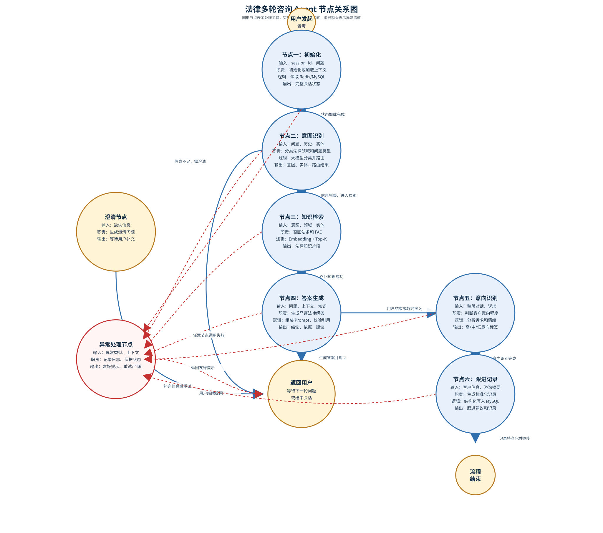
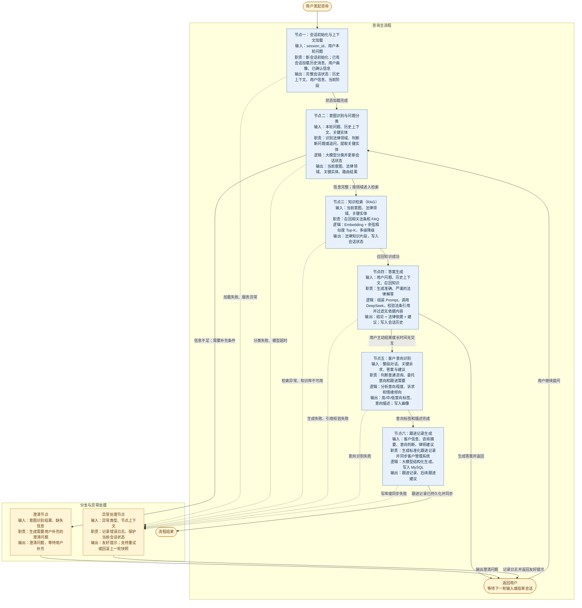
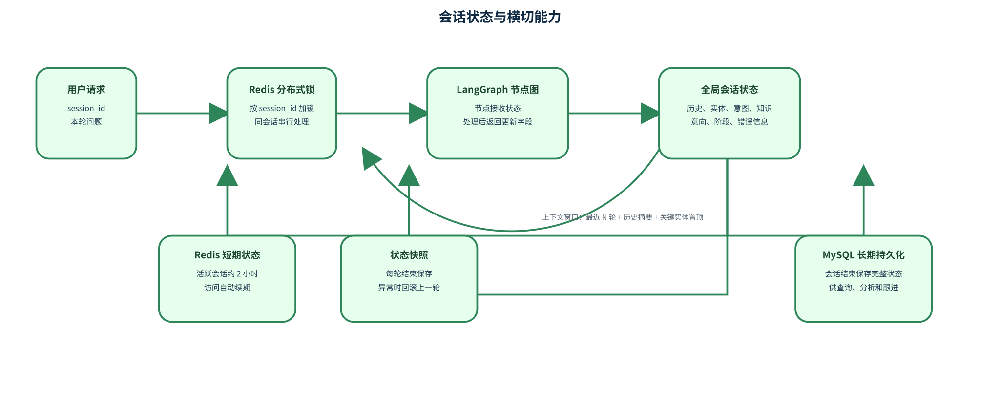
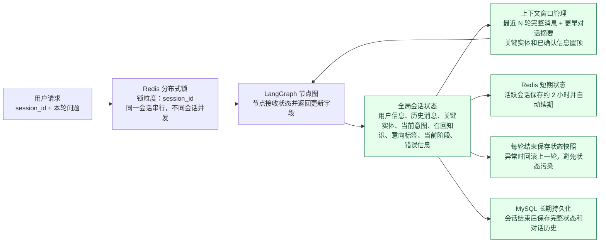

你们基于 LangGraph 实现的多轮咨询 Agent，具体是怎么编排节点的？会话状态怎么管理？
回答思路： 先讲 LangGraph 的核心概念，再按咨询流程讲每个节点的职责，最后讲会话状态管理的实现细节，结合法律多轮咨询的业务场景。
参考答案：
1. 为什么选 LangGraph 做 Agent 编排
  - 传统的 ReAct Agent 是"黑盒"循环，流程不可控，状态管理混乱，复杂多轮场景很容易跑偏。
  - LangGraph 把 Agent 执行流程建模成有向图，每个节点是一个明确的处理步骤，边是状态流转规则，流程可视化、可控、可调试，非常适合我们这种有明确业务流程的多轮咨询场景。
  - 而且 LangGraph 原生支持状态管理、分支判断、循环、人工介入，这些都是多轮咨询需要的能力。
2. 多轮咨询 Agent 的节点编排设计 我们把一次完整的法律咨询流程拆成 6 个核心节点，按有向图编排：
  - 节点一：会话初始化与上下文加载
    - 职责：新会话开始时初始化会话状态，已有会话则从存储中加载历史对话和上下文信息。
    - 处理逻辑：根据 session_id 从 Redis/MySQL 加载历史消息、用户画像、已确认的关键信息，注入到当前会话状态中。
    - 输出：完整的会话状态对象，包含历史上下文、用户信息、当前阶段等。
  - 节点二：意图识别与问题分类
    - 职责：理解用户本轮输入的意图，判断属于哪类法律问题（婚姻、劳动、刑事、合同等），以及是新问题还是对上一轮回答的追问/澄清。
    - 处理逻辑：用大模型做意图分类，同时提取问题中的关键实体（比如"劳动合同"、"工伤"），更新到会话状态中。
    - 分支逻辑：根据意图分类结果，路由到不同的知识检索路径；如果判断是信息不足需要澄清，路由到澄清节点。
  - 节点三：知识检索（RAG 节点）
    - 职责：根据识别出的意图和关键信息，从法律知识库中召回相关的法条和 FAQ。
    - 处理逻辑：调用法律问答 RAG 链路，做 Embedding + 余弦相似度 Top-K 召回，同时触发多级降级机制保障可用性。
    - 输出：召回的相关法律知识片段，存入会话状态供后续生成使用。
  - 节点四：答案生成
    - 职责：基于召回的法律知识和会话上下文，生成准确、严谨的法律解答。
    - 处理逻辑：
      1. 组装 Prompt：系统提示词（法律专家人设、回答规范）+ 历史对话上下文 + 召回的法律知识 + 用户当前问题。
      2. 调用 DeepSeek 大模型生成答案，要求结构化输出（结论 + 法律依据 + 建议）。
      3. 后处理：校验答案是否引用了召回的法条，过滤无依据的内容，格式化输出。
    - 输出：生成的答案文本，同时记录到会话历史中。
  - 节点五：客户意向识别
    - 职责：从对话中识别客户的意向程度，判断是普通咨询、有委托意向、还是需要跟进。
    - 处理逻辑：用大模型分析整段对话内容，提取客户的关键诉求和情绪倾向，输出客户意向标签（高意向/中意向/低意向）和意向描述。
    - 业务价值：这是律所销售场景的关键节点，高意向客户可以自动分配给律师跟进，提升转化率。
    - 输出：客户意向标签、意向描述，存入会话状态和客户画像。
  - 节点六：跟进记录生成
    - 职责：咨询结束后，自动生成结构化的跟进记录，不用客服手动写。
    - 处理逻辑：
      1. 汇总整段对话的核心信息：客户问题、咨询的法律领域、关键诉求、意向程度、律师建议。
      2. 调用大模型生成标准化的跟进记录，包含"客户基本信息 + 咨询摘要 + 意向判断 + 后续跟进建议"。
      3. 结构化写入 MySQL，同步到律所的客户管理系统。
    - 触发条件：会话结束（用户主动结束、或长时间无交互自动关闭）时触发。
    - 价值：大幅减少客服的文书工作，咨询记录标准化，方便后续复盘和跟进。
3. 节点间的流转规则（图的边）
  - 正常流程：初始化 → 意图识别 → 知识检索 → 答案生成 → 返回用户，用户继续提问则回到意图识别节点，循环执行。
  - 澄清分支：意图识别判断信息不足时，跳过检索和生成，直接输出澄清问题，等用户补充信息后再回到意图识别。
  - 结束分支：会话结束时，从答案生成节点流转到客户意向识别 → 跟进记录生成，然后结束。
  - 异常分支：任何节点调用失败（比如大模型超时、检索服务异常），流转到异常处理节点，返回友好提示，记录错误日志，不影响会话状态。
4. 会话状态管理实现
  - 状态数据结构：
    - 用一个字典对象作为全局状态，在所有节点间共享和传递，包含：session_id、用户信息、历史消息列表、已提取的关键实体、当前意图、召回的知识、客户意向标签、当前阶段、错误信息。
    - LangGraph 的每个节点接收状态对象，处理后返回更新的字段，框架自动合并到全局状态中，不用手动管理状态传递。
  - 状态持久化：
    - 短期状态：活跃会话存在 Redis 中，设置过期时间（比如 2 小时），访问时自动续期，读写速度快，适合高频交互。
    - 长期持久化：会话结束后，完整状态和对话历史写入 MySQL，永久保存，供后续查询、分析、跟进使用。
    - 快照机制：每轮对话结束后保存一次状态快照，异常情况可以回滚到上一轮状态，避免状态污染。
  - 上下文窗口管理：
    - 历史消息不会全量传给大模型，做滑动窗口处理，只保留最近 N 轮（比如 10 轮）完整消息，更早的对话用摘要压缩，控制 Token 消耗。
    - 关键实体和已确认信息单独提取出来，置顶放在 Prompt 最前面，保证不会因为窗口滑动丢失重要信息。
  - 并发安全：
    - 同一个会话的请求串行处理，用分布式锁（Redis 锁）防止并发请求导致状态错乱，比如用户快速连发两条消息。
    - 锁粒度是 session_id，不同会话之间完全并发，不影响整体性能。
5. 落地效果
  - 多轮咨询流程清晰可控，每个节点的输入输出都有日志，出问题能快速定位到具体节点，比黑盒 ReAct 好调试太多。
  - 会话状态管理完善，用户中途退出再回来能继续之前的咨询，上下文不丢失，体验连贯。
  - 客户意向识别和跟进记录自动生成，客服效率提升明显，律所销售线索的跟进及时率提高了不少

6. 多轮咨询 Agent 节点关系图

查看 Mermaid 源码

### 会话状态与横切能力

查看 Mermaid 源码

