# 律所 AI 平台数据库 ER 图

> 来源：`数据库设计.md`
>
> 说明：原文明确列出 9 张业务表，但只展开了 `sessions`、`messages`、`customers`、`llm_audit_logs`、`evaluation_cases` 的字段。`follow_up_records`、`quality_reports`、`skill_configs`、`system_configs` 在原文中只有表级职责，因此图中保留表节点并标注“源文档未展开字段”。字段类型根据字段语义推断，不等同于最终 DDL。

> [直接打开 SVG 图](数据库ER图.svg)

## ER 图

```mermaid
erDiagram
    sessions ||--o{ messages : "session_id"
    sessions ||--o{ llm_audit_logs : "session_id"
    sessions ||--o{ follow_up_records : "业务关联，FK未说明"
    sessions ||--o{ quality_reports : "业务关联，FK未说明"
    skill_configs ||--o{ evaluation_cases : "skill_name，逻辑关联"

    sessions {
        BIGINT id PK "会话ID"
        BIGINT tenant_id "律所ID，多租户隔离"
        BIGINT user_id "用户ID"
        VARCHAR session_type "咨询/质检/合同审查"
        VARCHAR status "进行中/已结束/人工接管"
        VARCHAR intent_tag "意向标签"
        TEXT summary "会话摘要"
        DATETIME started_at "开始时间"
        DATETIME ended_at "结束时间"
        DATETIME created_at "创建时间"
        DATETIME updated_at "更新时间"
        BIGINT created_by "创建人"
        BIGINT updated_by "更新人"
        DATETIME deleted_at "软删除时间"
    }

    messages {
        BIGINT id PK "消息ID"
        BIGINT session_id FK "所属会话"
        BIGINT tenant_id "律所ID，多租户隔离"
        VARCHAR role "user/assistant/system"
        LONGTEXT content "消息正文，大文本不建索引"
        INT token_count "Token数量"
        DECIMAL cost "消息成本"
        JSON tool_calls "工具调用记录"
        DATETIME created_at "创建时间"
        DATETIME updated_at "更新时间，通用审计字段"
        BIGINT created_by "创建人，通用审计字段"
        BIGINT updated_by "更新人，通用审计字段"
        DATETIME deleted_at "软删除时间，通用字段"
    }

    customers {
        BIGINT id PK "客户ID"
        BIGINT tenant_id "律所ID，多租户隔离"
        VARCHAR name "客户姓名"
        VARCHAR phone "手机号"
        VARCHAR email "邮箱"
        VARCHAR source "来源渠道"
        VARCHAR intent_level "高/中/低意向"
        JSON tags "客户标签"
        DATETIME latest_contact_at "最近联系时间"
        DATETIME created_at "创建时间"
        DATETIME updated_at "更新时间"
        BIGINT created_by "创建人，通用审计字段"
        BIGINT updated_by "更新人，通用审计字段"
        DATETIME deleted_at "软删除时间，通用字段"
    }

    follow_up_records {
        BIGINT id PK "记录ID，字段详情未在源文档展开"
        BIGINT tenant_id "通用多租户字段"
        VARCHAR schema_note "源文档未提供其余字段定义"
        DATETIME created_at "通用审计字段"
        DATETIME updated_at "通用审计字段"
        BIGINT created_by "通用审计字段"
        BIGINT updated_by "通用审计字段"
        DATETIME deleted_at "通用软删除字段"
    }

    quality_reports {
        BIGINT id PK "报告ID，字段详情未在源文档展开"
        BIGINT tenant_id "通用多租户字段"
        VARCHAR schema_note "源文档未提供其余字段定义"
        DATETIME created_at "通用审计字段"
        DATETIME updated_at "通用审计字段"
        BIGINT created_by "通用审计字段"
        BIGINT updated_by "通用审计字段"
        DATETIME deleted_at "通用软删除字段"
    }

    skill_configs {
        BIGINT id PK "配置ID，字段详情未在源文档展开"
        BIGINT tenant_id "通用多租户字段"
        VARCHAR schema_note "Skill配置表；原文另述配置即代码"
        DATETIME created_at "通用审计字段"
        DATETIME updated_at "通用审计字段"
        BIGINT created_by "通用审计字段"
        BIGINT updated_by "通用审计字段"
        DATETIME deleted_at "通用软删除字段"
    }

    evaluation_cases {
        BIGINT id PK "用例ID"
        BIGINT tenant_id "通用多租户字段；原文总则要求业务表具备"
        VARCHAR skill_name "Skill名称"
        VARCHAR version "Skill版本"
        JSON input "评测输入"
        JSON expected_output "预期输出"
        JSON assertions "断言配置"
        VARCHAR category "用例分类"
        DATETIME created_at "创建时间"
        DATETIME updated_at "更新时间"
        BIGINT created_by "创建人，通用审计字段"
        BIGINT updated_by "更新人，通用审计字段"
        DATETIME deleted_at "软删除时间，通用字段"
    }

    llm_audit_logs {
        BIGINT id PK "审计日志ID"
        BIGINT tenant_id "律所ID，多租户隔离"
        BIGINT session_id FK "关联会话"
        VARCHAR skill_name "Skill名称"
        VARCHAR model_name "模型名称"
        INT input_tokens "输入Token数"
        INT output_tokens "输出Token数"
        INT embedding_tokens "Embedding Token数"
        DECIMAL input_price_snapshot "输入价格快照"
        DECIMAL output_price_snapshot "输出价格快照"
        DECIMAL estimated_cost "估算成本"
        VARCHAR status "调用状态"
        TEXT error_msg "错误信息"
        INT duration_ms "耗时毫秒"
        DATETIME created_at "创建时间"
        DATETIME updated_at "更新时间，通用审计字段"
        BIGINT created_by "创建人，通用审计字段"
        BIGINT updated_by "更新人，通用审计字段"
        DATETIME deleted_at "软删除时间，通用字段"
    }

    system_configs {
        BIGINT id PK "配置ID，字段详情未在源文档展开"
        BIGINT tenant_id "通用多租户字段"
        VARCHAR schema_note "系统配置表；源文档未提供其余字段定义"
        DATETIME created_at "通用审计字段"
        DATETIME updated_at "通用审计字段"
        BIGINT created_by "通用审计字段"
        BIGINT updated_by "通用审计字段"
        DATETIME deleted_at "通用软删除字段"
    }
```

## 表与索引明细

| 表 | 关键索引 | 用途与优化说明 |
|---|---|---|
| `sessions` | `(tenant_id, user_id)`、`(tenant_id, status)`、`(tenant_id, created_at)` | 按租户、用户、状态和时间查询；会话列表可扩展覆盖索引 `(tenant_id, created_at, status, intent_tag)` |
| `messages` | `(session_id, created_at)`、`(tenant_id, created_at)` | 按会话按时间读取消息；`content` 为大文本，不建普通索引，全文检索交给 ES 或专用检索服务 |
| `customers` | 唯一 `(tenant_id, phone)`、`(tenant_id, intent_level)`、`(tenant_id, latest_contact_at)` | 保证同租户手机号唯一，并支持意向和最近联系时间查询 |
| `llm_audit_logs` | `(tenant_id, created_at)`、`(skill_name, created_at)`、`session_id` | 支持租户、时间、Skill 维度成本分析；数据量大时按月分表或归档 |
| `evaluation_cases` | `(skill_name, version)` | 按 Skill 版本加载评测用例 |
| `follow_up_records` | 源文档未提供 | 需结合实际跟进流程补充字段和索引 |
| `quality_reports` | 源文档未提供 | 需结合质检查询场景补充字段和索引 |
| `skill_configs` | 源文档未提供 | 原文说明 Prompt、参数、模型选择可配置，且配置即代码 |
| `system_configs` | 源文档未提供 | 需结合系统配置读取场景补充字段和索引 |

## 统一数据库约束

- 所有业务表按 `tenant_id` 做租户隔离；GORM Query/Create/Update/Delete 回调自动注入和过滤，超级管理员跨租户操作必须显式跳过并记录审计日志。
- 业务表采用 `deleted_at` 软删除；日常查询自动排除已删除数据，特殊场景使用 `Unscoped()`。
- 通用审计字段为 `created_at`、`updated_at`、`created_by`、`updated_by`；原文个别表的字段清单没有重复列出这些字段，本图按总则补齐。
- 联合索引优先使用 `tenant_id` 作为最左列；单表索引控制在 5 个以内，定期清理无用和重复索引。
- 时间条件使用范围查询，不对 `created_at` 使用 `DATE()` 等函数；深分页使用游标分页；查询只取必要字段，避免 `SELECT *`。
- 历史会话、历史质检报告和高增长审计日志进行归档或冷热分离，主表只保留近期热数据。
- 事务保持短小，外部大模型/HTTP 调用放在事务外；批量写入使用批量 SQL；复杂联查和聚合允许使用原生 SQL。

## 需要补充的 DDL 信息

源文档尚未给出以下内容，当前图无法替代正式建表脚本：

- `follow_up_records`、`quality_reports`、`skill_configs`、`system_configs` 的完整字段、类型、是否为空和默认值。
- 各表主键是自增整数、UUID 还是雪花 ID，以及字符集、排序规则和存储引擎。
- `session_id`、`tenant_id` 等关联字段是否建立真正的数据库外键，还是仅由应用层维护。
- `evaluation_cases` 是否确实包含 `tenant_id` 和软删除字段；图中按“所有业务表统一约束”处理。
- 金额字段的精度、Token 字段的上限、枚举值和状态机约束。
